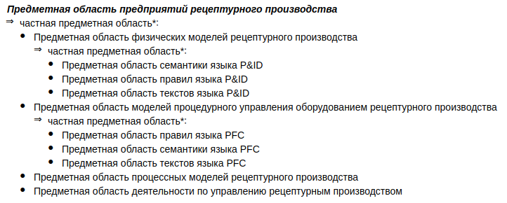
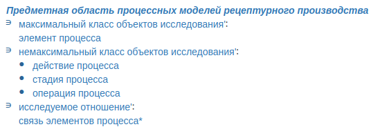
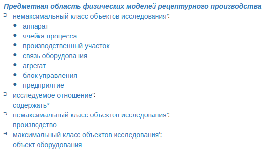
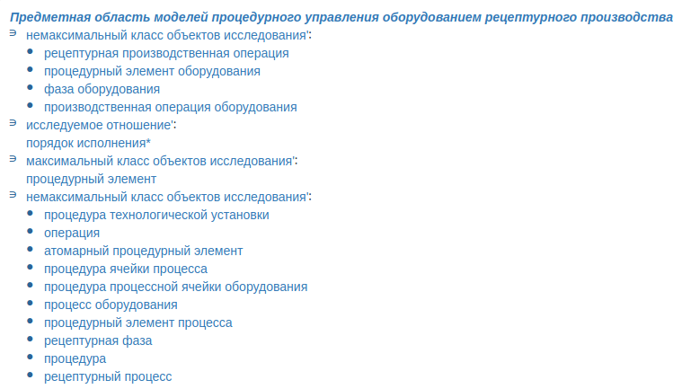
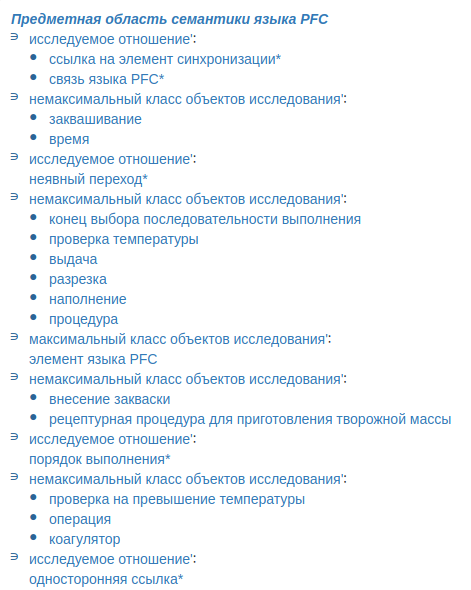
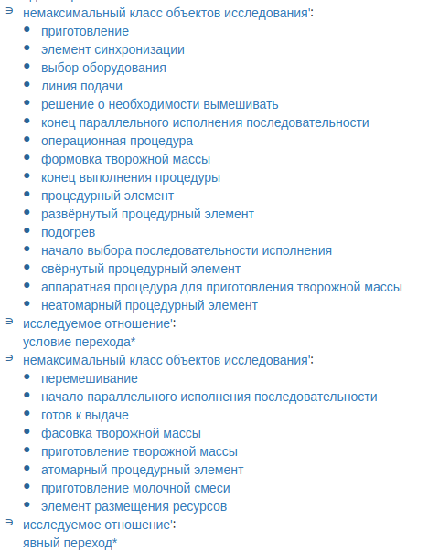
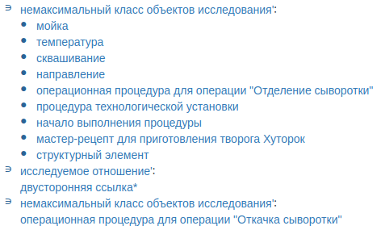
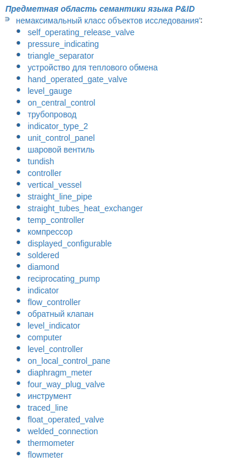
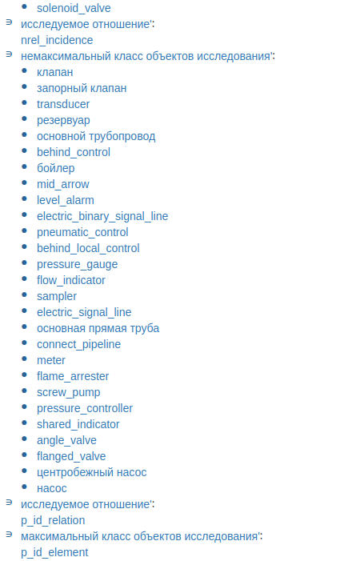
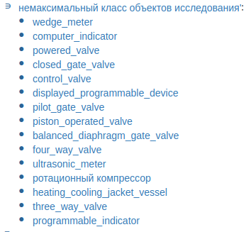

Общая иерархия предметных областей:

**Нераспределенные понятия**

common resource  
= общий ресурс

exclusive-use resource  
= исключительно используемый ресурс

shared-use resource  
= совместно используемый ресурс

recipe entity  
= рецептурный объект

recipe  

general recipe  
= общий рецепт

site recipe  
= местный рецепт

master recipe  
= главный рецепт

control recipe  
= управляющий рецепт

unit recipe  
= установочный рецепт

formula  
= рецептурная формула

header  
= заголовок рецепта

recipe procedure  
= процедура рецепта  
= технология рецепта

line  
= линия  
= train

procedure  
= технология

batch  
= партия

process  
= производственный процесс

process input  
= вход процесса

process output  
= выход процесса

process parameter  
= параметр процесса

state  
= производственное состояние

lot  
= порция

mode  
= режим

path  
= маршрут  
= поток  
= stream

batch control  
= управление партиями

procedural control  
= технологическое управление

coordination control  
= координационное управление

process control  
= управление процессом

recipe management  
= управление рецептурными данными

basic control  
= базовое управление

process management  
= процессное управление

unit supervision  
= управление оборудованием

equipment control  
= оборудовательное управление

exception handling  
= обработка исключений
