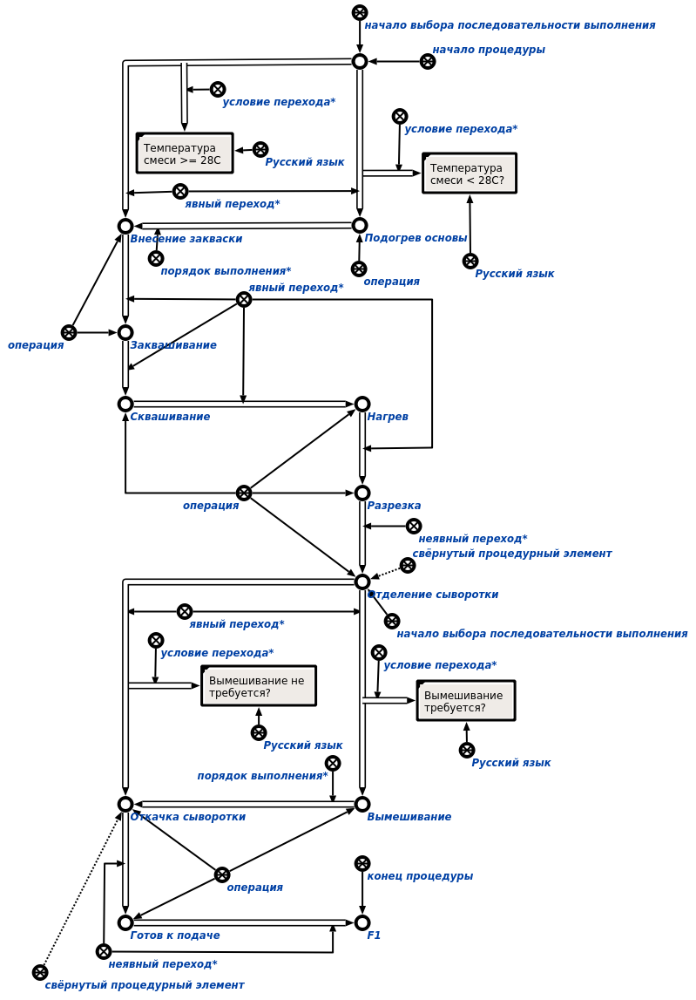
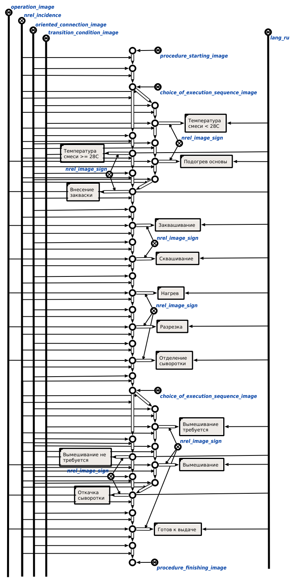
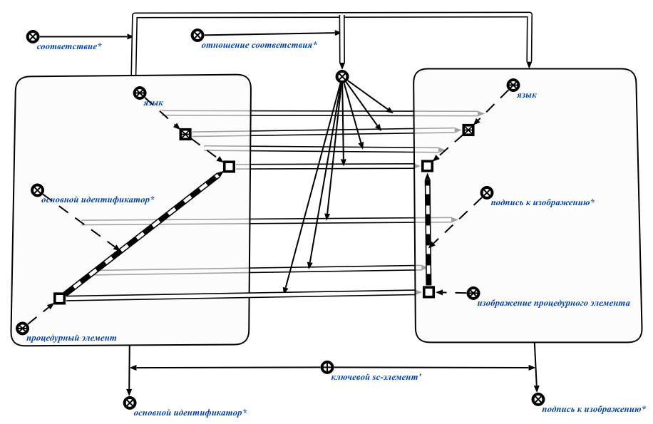
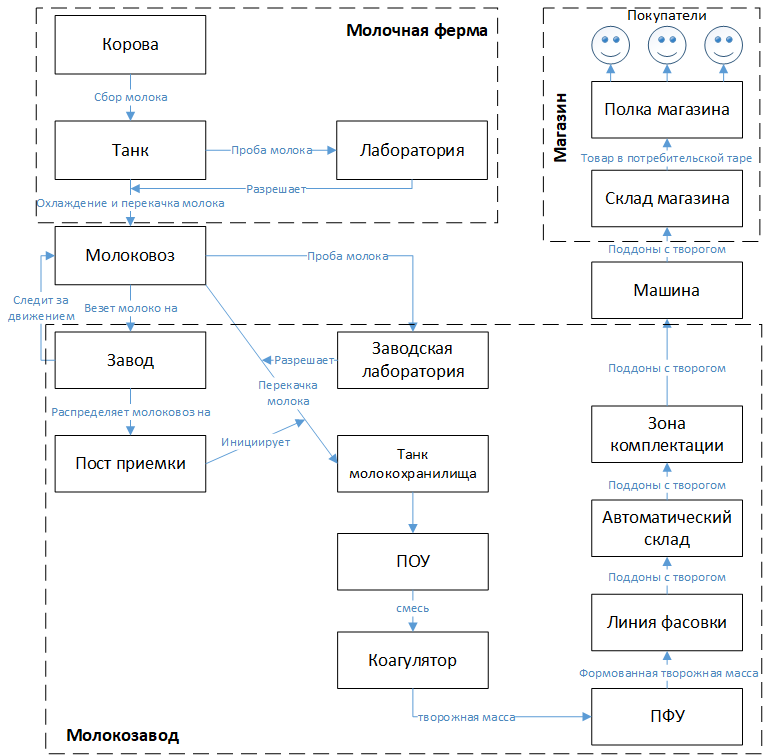
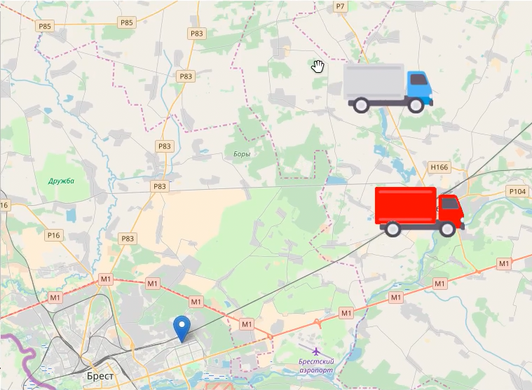
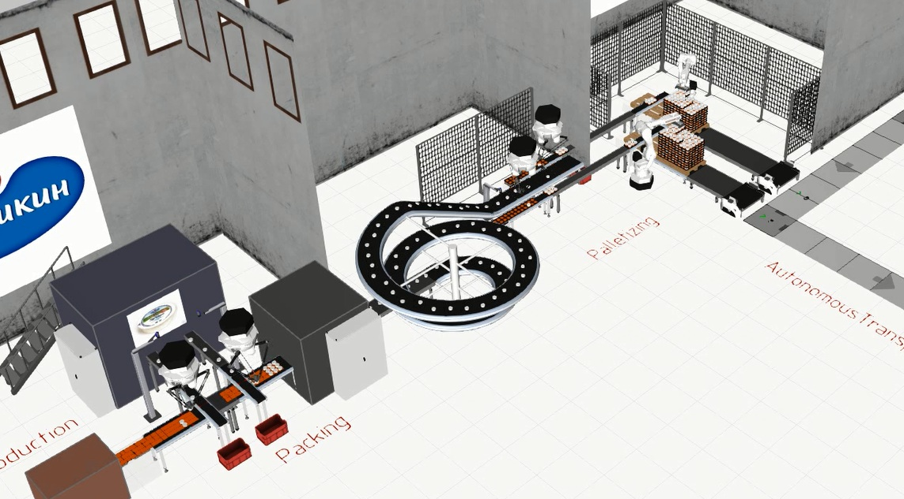

# ПРОЕКТИРОВАНИЕ ПРЕДПРИЯТИЯ РЕЦЕПТУРНОГО ПРОИЗВОДСТВА В КОНТЕКСТЕ КОНЦЕПЦИИ INDUSTRY 4.0

**Аннотация.** В данной работе предлагается развитие онтологического подхода к проектированию предприятий рецептурного производства, заключающееся в переходе от рассмотрения производственных процессов в рамках одного предприятия, к рассмотрению процессов, охватывающих, в соответствии с концепцией Industry 4.0, и смежные предприятия - поставщиков сырья (молочные фермы) и оптовых потребителей продукции (магазины, торговые сети). Особое внимание уделяется логистическим процессам – приводится краткое описание основных логистических процессов, касающихся производства творога, структура предметной области логистики и пример формализации нештатной логистической ситуации. Обосновывается соответствие  многоагентной системы предприятия со взаимодействием агентов через общую память основным принципам Industry 4.0. В рамках формализации стандартов рассматривается формализация внешнего языка спецификации процедурных моделей Procedure Function Chart, определенного во второй части стандарта ISA-88. Формализация внешнего языка позволяет организовать взаимодействие с пользователями системы автоматизации предприятия на основе унифицированного подхода с использованием понятного инженерному персоналу языка диаграмм. Рассматривается также агентно-ориентированный подход к организации взаимодействия роботов в рамках роботизированных производственных комплексов, основанный на взаимодействии через общую семантическую память.

**Ключевые слова:** комплексная автоматизация производства, логистический процесс, онтологическая модель предприятия, Industry 4.0, киберфизическая система, онтология, база знаний, многоагентная система, технология OSTIS.

## 1. Введение
Данная статья рассматривает дальнейшее развитие автоматизации предприятий рецептурного производства на примере ОАО "Савушкин продукт". Оно состоит в переходе от рассмотрения производственных процессов, происходящих в рамках конкретного предприятия, к рассмотрению полного продуктового цикла - от получения заявки от магазина-клиента до ее выполнения (удовлетворения запроса потребителя). Данный процесс, кроме самого предприятия, включает в качестве субъектов молочные фермы, логистические службы, магазины и др. Также даже в рамках одного предприятия на сегодняшний день используются разрозненные системы (несколько SCADA-систем, система управления транспортом, система управления складом и др.). Стыковка таких систем и поддержка согласованности информации в них осуществляется вручную (либо опускается). Сейчас существует потребность автоматизировать согласование информации и обеспечить, там где это уместно, взаимодействие устройств на разных этапах продуктового цикла. Наличие такой потребности привело к появлению инициативы Industry 4.0 в Германии и ей аналогичных в других странах мира.

Таким образом, целью работы является развитие предложенной в [Савушкин, 2017] онтологической модели предприятия рецептурного производства для расширения круга описываемых этапов производства, в соответствии с концепцией Industry 4.0, процессами, не происходящими непосредственно на предприятии, но касающимися производства. В качестве примера можно привести внешние логистические процессы - доставка молока с фермы на завод и готового продукта с завода заказчику.

### 1.1 Концепция Industry 4.0 и киберфизические системы
Концепция Industry 4.0 была сформулирована в Германии в 2011 году. Она подразумевает создание и внедрение в производство т.н. киберфизических систем (КФС) и использование интернета вещей и услуг в производственных процессах [I4Report]. Стоит отметить, что этот термин специфичен для Германии и за ее пределами используется редко. Аналогичные концепции в других странах называются по-разному - "умная фабрика" (Нидерланды), "фабрика будущего" (Италия), "промышленный интернет" (США).

Основные принципы концепции Industry 4.0 [DesignPrinciples 2016]:

- **Взаимодействие**. Возможность взаимодействия устройств, датчиков, людей посредством Интернета вещей (IoT), Интернета людей (IoP), Интернета услуг (IoS).
- **Виртуализация**. Означает способность киберфизической системы контролировать физические процессы. Данные сенсоров проецируются на модель предприятия, включающих состояние всех киберфизических систем. В случае возникновения нештатной ситуации должна быть возможность уведомить оператора, предоставив ему информацию по ее устранению и обеспечению безопасности, тем самым осуществляя поддержку принятия решений персоналом.
- **Децентрализация**. Растущая потребность в штучных партиях заказных продуктов увеличивает сложность централизованного управления производством. КФС могут иметь встроенные вычислительные модули, позволяющие им принимать решения самостоятельно и переадресовывать задачу управляющей системе только в случае необходимости. Несмотря на это, необходимо обеспечить контроль качества конечного продукта и прослеживаемость, что требует централизованного управления. К примеру, необходимые шаги производственного процесса могут быть закодированы в RFID-метках, что освобождает от необходимости централизованного управления данным аспектом производства малых партий продукта.
- **Анализ и реагирование в реальном времени**. С целью управления производством необходимо, чтобы данные с сенсоров постоянно собирались и анализировались в режиме реального времени. В случае отказа одной производственной установки, можно "перепоручить" её задачу другой.
- **Ориентированность на услуги**. Услуги компаний, КФС и людей доступны в Интернете услуг и могут быть использованы другими участниками. Услуги могут предоставляться как внутри предприятия, так и другим предприятиям. КФС предоставляют свои услуги в виде веб-служб. Это позволит реализовать производство продукта путем комбинирования производственных операций в соответствии со спецификацией клиента, закодированной, например на RFID-метке.
- **Модульность**. Система должна быть гибкой, т.е. легко адаптируемой к меняющимся требованиям (например, сезонным изменения в потреблении, изменению характеристик продукта или производства). Адаптация должна осуществляться заменой или расширением отдельных компонентов системы. Обеспечение совместимости компонентов требует наличия стандартизированных механизмов взаимодействия, позволяющих автоматически идентифицировать компоненты и включать их в интернет услуг.

Под КФС понимается совокупность интеллектуальных, легко интегрируемых физических компонентов со встроенными в них вычислительными ресурсами, тесно взаимодействующих между собой и отслеживающих изменения в состоянии внешнего мира [Suh 2014].

Для построения КФС предприятия необходима интеграция вычислительных ресурсов и физико-технических процессов. Сенсоры, манипуляторы, информационные и управляющие системы должны взаимодействовать между собой на всех этапах производства, в том числе и выходящих за рамки одного конкретного предприятия [Тарасов 2016]. Следует, однако, понимать, что внедрение новых систем автоматизации, в том числе интеллектуальных, на предприятии должно основываться на уже имеющихся у предприятия ресурсах  [Galbrecht 2017].

Потребность в комплексной автоматизации сложных процессов, требующих согласованной работы множества служб и технических средств, создает потребность в разработке подобных систем. В дальнейшем будем рассматривать повышение уровня автоматизации предприятий рецептурного производства в рамках проектирования КФС отвечающей за производство творога “Хуторок на ОАО “Савушкин продукт”.

Такая КФС должна обеспечивать комплексную информационную поддержку и автоматизацию процесса производства творога “Хуторок” от доения коровы до поступления готовой продукции в магазин. В этом процессе можно выделить следующие основные стадии: 
1. сбор молока на ферме; 
2. доставка молока с фермы на молокозавод;
3. обработка молока на молокозаводе и получение творога;
4. формовка и упаковка творога;
5. доставка продукции со склада завода на склад заказчика (магазина, торговой сети и т.п.).

### 1.2. Проблемы разработки систем комплексной автоматизации предприятия и предлагаемый подход к их решению.

Основной проблемой, возникающей при разработке системы комплексной автоматизации является проблема интеграции различных компонентов системы и обеспечения взаимодействия между ними. Решение данной проблемы традиционным способом, предполагающим разработку средств коммуникации между разнородными компонентами системы (интерфейсов, протоколов и т.д.) с одной стороны, приводит к существенным накладным расходам, связанным с разработкой таких средств, с другой стороны - сильно усложняет архитектуру такой системы, значительно повышая трудоемкость ее сопровождения и развития. Очевидно, что постоянное развитие технологий производства на различных его этапах и расширение самого производства обуславливает требование гибкости к системе автоматизации, то есть способности легко дополнять ее различными компонентами и модифицировать уже существующие компоненты при необходимости.

Для решения перечисленных проблем предлагается развитие идей онтологического подхода к проектированию предприятий на основе Технологии OSTIS [Савушкин 2017]. Предприятие предлагается рассматривать как единую информационную многоагентную систему, в рамках которой:

* вся информация объединяется в единое информационное пространство (базу знаний предприятия, которая хранится в семантической памяти);

* все участники процесса (люди, роботизированные системы, различного рода производственные комплексы и т.д.) трактуются как агенты над этой общей базой знаний. Это означает, что они (а) отслеживают интересующие их ситуации в базе знаний и реагируют на них (б) описывают результаты своей деятельности в базе знаний, для того чтобы эта информация была доступна другим агентам и они могли ее анализировать.. В конечном итоге весь менеджмент процессов производства при таком подходе сводится к грамотной спецификации задач в такой общей базе знаний, указания их приоритетов, исполнителей, сроков выполнения и т.д.

* база знаний системы имеет иерархическую организацию, т.е. представляет собой иерархию предметных областей и соответствующих им онтологий.

* сама многоагентная система также имеет иерархическую организацию - агенты могут объединяться в коллективы произвольной степени вложенности (членом коллектива агентов также может быть коллектив агентов). Например, группа роботизированных систем может быть логически (или даже физически) объединена в целый роботизированный комплекс, способный решать задачи определенного класса.

Многоагентная система над общей базой знаний, реализованная по Технологии OSTIS, таким образом, отвечает концепции Industry 4.0 и, следовательно, может рассматриваться как киберфизическая:
 
* **общая база знаний** реализует принцип взаимодействия людей, датчиков и устройств, выступая  посредником такого взаимодействия, **виртуализации** - в базе знаний представляется модель предприятия и сопутствующих физических процессов с необходимым уровнем детализации, **ориентированности на услуги** - каждый участник производственного процесса (агент) специфицируется в рамках общей базы знаний, включая свою функциональность (предоставляемые услуги), **модульности** - за счет представляемых в ней библиотек совместимых, повторно используемых компонентов.
* **многоагентный подход** реализует принцип **децентрализации** по определению многоагентной системы [Тарасов 2002], **анализа и реагирования** - агенты отслеживают состояние базы знаний предприятия и активизируются при возникновении определенных ситуаций (в том числе нештатных).

Предложенный подход обладает рядом преимуществ, таких как:

* отсутствие необходимости разработки средств непосредственного взаимодействия компонентов системы (человек-роботизированная система, человек-человек и т.д.) за счет их взаимодействия посредством общей памяти;

* за счет того, что все агенты взаимодействуют посредством общей памяти, в общем случае для системы не важно, как физически устроен тот или иной агент. Таким образом, постепенная замена ручного труда автоматизированными системами или совершенствование таких систем не требует внесения изменений в общую систему автоматизации;

* за счет использования общей единой базы знаний и широких возможностей ассоциативного поиска в такой базе знаний любой участник процесса производства в любой момент времени имеет доступ ко всей необходимой ему информации, а не к каким-либо заранее предусмотренным ее фрагментам, расширение числа которых может быть связано с дополнительными накладными расходами. Таким образом, существенно облегчается процесс мониторинга различных процессов и ускоряется поиск ответов на интересующие пользователя вопросы. При этом запросы пользователя к системе могут уточняться различными способами;

* одна и та же информация, хранимая в базе знаний может по-разному визуализироваться для различных категорий пользователей, при этом  сама информация будет оставаться неизменной, будут меняться только средства её отображения. Таким образом, отсутствует необходимость дублирования информации;

* поскольку все производственные процессы специфицируются в базе знаний и управляются ей, внесение изменений в такие процессы в общем случае сводится к внесению изменений в базу знаний и, при необходимости, замене соответствующего оборудования. При этом существенно снижаются накладные расходы на перепрограммирование компонентов системы, налаживание взаимодействия между ними.

* спецификация всех производственных процессов в единой базе знаний предоставляет широкие возможности для их автоматического анализа, в том числе - постоянного мониторинга текущих процессов, автоматического выявления и устранения нештатных ситуаций, оптимизации текущих процессов, автоматического планирования будущих процессов и т.д.

### 1.3. Архитектура предлагаемой системы

Предлагаемая система разрабатывается на основе Технологии OSTIS, а значит в соответствии с ней состоит из базы знаний, машины обработки знаний и пользовательского интерфейса.

В общем случае база знаний системы автоматизации предприятия содержит [Савушкин OSTIS 2017]:

* онтологии соответствующих отрасли промышленных стандартов, таких, как ISA-88 [ISA88]
* модели предприятия, построенные на основе этих онтологий (в случае ISA-88 - физическая, процедурная, процессная и др.)
* онтологии усовершенствования предприятия, формализующие принципы усовершенствования и адаптации предприятия к меняющимся внешним условиям
* средства коллективной разработки баз знаний предприятия и соответствующих компонентов машин обработки знаний
* модели пользовательских интерфейсов систем управления предприятием
* модели информационного обслуживания различных категорий пользователей
* модели представления знаний предприятия, с помощью которых предприятие можно описать во всех необходимых аспектах:
  * модель управления знаниями предприятия [Гаврилова 2016]; 
  * онтологическая модель предприятия [Шведин 2010];
  * многоагентная модель предприятия [Тарасов 2002];
  * модель ситуационного управления предприятием [Поспелов 1986];
  * реинжиниринга бизнес-процессов [Робсон 1996].

В предыдущей работе [Савушкин 2017] рассмотрена формализация стандартов, в частности, ISA-88, в виде семейства онтологий, показаны фрагменты моделей предприятия, построенных на его основе. В данной работе также затрагивается стандарт ISA-88, но внимание заостряется на языке спецификации процедурных моделей предприятия - PFC, который описан в главе 6 второй части данного документа [ISA88.02]. Кроме того, статья показывает развитие онтологической модели предприятия для формального описания процессов, происходящих за пределами предприятия, в частности, логистических.

База знаний КФС предприятия для комплексного описания процесса производства должна, среди прочих, содержать следующие модели:

* модели языков описания ячеек производства
* модели ячеек производства, описанные с помощью этих языков
* модели логистических процессов
* модель взаимодействия промышленных роботов

Модель логистических процессов необходима на всех этапах производства для описания внутренних (межцеховая логистика, складская логистика) и внешних логистических процессов (взаимодействие с фермами - поставщиками сырья и магазинами - заказчиками конечной продукции). Модели языков описания и описанные с их помощью модели ячеек используются в рамках третьей и четвертой  стадий, упомянутых во введении к статье, для формализации процесса производства и структуры используемого для этого оборудования. Модель взаимодействия промышленных роботов уточняет физическую модель предприятия, причем понятие робота имеет расширенную трактовку - под ним могут пониматься также технологические установки и их комплексы, работающие либо с минимальным вмешательством человека, либо вовсе без него.

## 2. Реализация моделей, используемых для описания предприятия и его процессов

### 2.1 Модель языков описания ячейки производства творога “Хуторок”

Для удобства работы персонала предприятия с системой  комплексной автоматизации, необходимо обеспечить, с одной стороны, возможность взаимодействия системы с пользователями удобными им способами (в том числе - с использованием различных графических языков, на ограниченном естественном языке и посредством речевых сообщений), с другой стороны - обеспечить возможность добавления в систему новых языковых средств, например, новых графических языков. 

Каждая интеллектуальная система оперирует базой знаний на внутреннем языке, и диалог осуществляется как обмен сообщениями между пользователем и системой. Чтобы такой диалог состоялся, необходимо отобразить фрагмент базы знаний во внешнюю форму. Такая форма может иметь как универсальный, так и специализированный характер.

Универсальным внешним языком обмена сообщениями будем называть язык внешнего обмена сообщениями, позволяющий описывать знания любого вида. К таким языкам относится SC-код и все его представления.

Трансляция с внутреннего языка на внешний и обратно организовывается так, чтобы механизмы трансляции не зависели от внешнего языка, для реализации нового специализированного языка в таком случае необходимо будет только описать его синтаксис и семантику, универсальная же модель трансляции не будет зависеть от данного описания.

Каждый язык характеризуется тремя важнейшими аспектами, каждый из которых описывается в соответствующей онтологии:

* Онтология семантики языка
* Онтология текстов языка
* Онтология правил языка

**Онтология семантики языка** подразумевает выделение набора однозначно определенных сущностей, понятных на ассоциативном уровне и несущих некоторую смысловую нагрузку.

**Онтология текстов языка** исследует синтаксические структуры, являющиеся изображениями, символьными представлениями сущностей языка. Количество этих изображений (символов) не ограничено и зависит от употребляемого контекста.

**Онтология правил языка** направлена на рассмотрение правил языка задают однозначные соответствия между множеством сущностей (алфавитом языка) и множеством изображений (знаков файлов), используемых для трансляции текстов в память интеллектуальной системы и из нее, а также для визуализации этих текстов.

Механизм трансляции обеспечивается благодаря наличию в системе набора рецепторных и эффекторных агентов[Шункевич 201X] в режиме постоянного обмена сообщениями между пользователем и системой. Данный механизм обмена сообщениями выглядит следующим образом:

1. Пользователь с помощью редактора на синтаксисе одного из специализированных внешних языков записывает некоторую информацию.
2. Рецепторные агенты фиксируют факт начала трансляции записанной синтаксической структуры.
3. Эффекторные агенты преобразует синтаксическую структуру с помощью набора правил в последовательность sc-элементов, составляющих фрагмент семантически связного sc-текста, однозначно интерпретируемого в памяти системы.
4. Если пользователь делает изменения в полученном sc-тексте, то происходит обратный процесс: устанавливается соответствие между знаками сущностей и их изображениями, в результате чего отображается синтаксическая структура на выбранном языке.

**Семантика** любого языка подразумевает выделение набора однозначно определенных сущностей, достаточных для написания текстов, несущих смысловую нагрузку для пользователя или машины (системы). Под текстами языка понимаются **синтаксические структуры**, являющиеся изображениями сущностей языка. Наконец, **правила** языка задают однозначные соответствия между множеством сущностей (алфавитом языка) и множеством изображений (знаков файлов), используемых для трансляции текстов в память интеллектуальной системы и из нее, а также для визуализации этих текстов.

В процессе описания каждого языка можно выделить некоторые аспекты, являющиеся общими для всех языков или для конкретного семейства языков. Исследования в этой области направлены на обоснование некоторого метаязыка, задающего структуру описания большинства существующих языков. Данный метаязык даст толчок к развитию естественно-языковых интерфейсов и позволит привнести в лингвистические аспекты любого языка алгоритмическую точность.

Технология производства творога может быть описана по стандарту ISA S88. В контексте автоматизированного производства и стандарта ISA-88, выделяются следующие специализированные внешние языки - язык описания процедурной модели (PFC) и язык описания физической модели (P&ID). С помощью языка PFC будет описан фрагмент производственной ячейки по изготовлению творога “Хуторок”, который будет рассмотрен далее.

Язык PFC определяется в главе 6 стандарта ISA-88.00.02 и предназначен для описания рецептов со сложными процедурами, включающими параллельные шаги и условные ветвления. PFC-диаграммы изображают процедурную логику, используя набор значков, соединенных направленными связями, указывающими порядок исполнения процедурных элементов.

Алфавит языка PFC включает следующие элементы:

* процедурные элементы - элементы процедурной иерархии (фазы, операции и др.);
* дополнительные элементы - элементы, отвечающие за распределение, согласование и движение продукта в рамках процедуры (элемент размещения, элемент синхронизации)
* структуры, представленные в виде классов временных сущностей, задающих порядок исполнения процедурных элементов (выбор ветви исполнения, параллельно исполняемые ветви);
переходы между процедурными и дополнительными элементами (неявный и явный переход, требующий выполнения некоторого условия).

### 2.2 Модель ячейки производства творога “Хуторок”
В качестве примера использования процедурной модели будет использована ячейка производства творога “Хуторок” предприятия “Савушкин продукт”. Данная ячейка отражает стадию обработки молока на заводе на примере изготовления конкретного продукта. Структура проекта “Хуторки” представлена ниже:

**Проект «Хуторки»**

=> включение*:

* мастер-рецепт
	
=> включение*:

* рецептурная процедура
* аппаратная процедура

=> включение*:

* операция “Отделение сыворотки”
* операция “Откачка сыворотки”

Мастер-рецепт описывает процесс от обработки молочной смеси до фасовки творожной массы. Рецептурная и аппаратная процедуры фокусируются на изготовлении творожной массы как на этапе выполнения мастер-рецепта. Наконец в рамках аппаратной процедуры акцентируется вниманием на операция отделения и откачки сыворотки.

Запись аппаратной процедуры на языке PFC, алфавит которого был описан ранее:

Рисунок - Аппаратная процедура производства творога

Запишем структуру языка PFC, предварительно обозначив классы сущностей и отношений, использующихся в тексте:

**элемент языка PFC**  
=> включение\*: 
● структурный элемент 
● процедурный элемент 

**Структурный элемент** — элемент языка PFC, который вместе со множеством процедурных элементов образует диаграмму языка PFC.

**Процедурный элемент** — элемент процедурной иерархии, в которую также входят фазы и операции.

**порядок выполнения*** 
<= разбиение\*: 
{ 
● неявный переход\* 
● явный переход\* 
} 

**Неявный переход\*** — бинарное отношение, первым компонентом связки которого является процедурный элемент, после выполнения которого начнётся выполнение процедурного элемента, являющегося вторым компонентом связки отношения.

**Явный переход\*** — бинарное отношение, вторым компонентом связки которого является процедурный элемент, выполнение которого начнётся после выполнения процедурного элемента, являющегося первым компонентом связки и проверки некоторого условия.

**Условие перехода\*** — бинарное отношение, первым компонентом связок которого является связка отношения **явный переход\***, вторым - знак структуры, содержащей ожидаемый результат выполнения процедуры.

Рисунок - SCg-представление аппаратной процедуры производства творога

Далее рассмотрим исследуемые объекты Онтологии текстов языка PFC и пример синтаксической структуры, соответствующей аппаратной процедуре:

**изображение элемента языка PFC** 
=> включение*: 
● изображение элемента размещения ресурсов 
● изображение элемента синхронизации 
● изображение процедурного элемента 
● изображение вложенности процедурного элемента 
● изображение элемента выполнения процедуры 
● изображение связи 

**Изображение элемента размещения ресурсов** — изображение овала, идентификатором* которого является спецификация ресурса.

**Изображение элемента синхронизации** — изображение прямоугольника, смежного изображению линейного примитива, являющегося высотой прямоугольного примитива процедурного элемента.

**Изображение процедурного элемента** — изображение прямоугольного примитива, количество выделенных прямых углов которого указывает на позицию процедурного элемента в процедурной иерархии.

**Изображение вложенности процедурного элемента** — изображение плюса, находящееся внутри правого выделенного обратного от наблюдателя прямого угла изображения процедурного элемента и касающегося границы этого выделенного угла.

**Изображение элемента выполнения процедуры** — изображение графического примитива, связанного с этапом выполнения процедурного элемента.

**Изображение связи** — изображение линейного примитива, инцидентного изображениям элементов языка PFC.

**Подпись к изображению\*** — бинарное отношение, первым компонентом связок которого является знак изображения процедурного элемента, а вторым - знак файла, содержащего некоторое текстовое пояснение к изображению процедурного элемента.

Рисунок - Синтаксическая структура PFC-диаграммы аппаратной процедуры производства творога

Любое правило Онтологии правил языка PFC представляет собой соответствие, заданное на атомарных формулах. Правило идентификации сущности с позиции синтаксического и семантического аспекта рассмотрено ниже:

Рисунок - Правило трансляции

### 2.3 Онтологическая модель логистической цепочки производства творога

Любая производственная задача может рассматриваться как комплексная логистическая задача. Однако логистические процессы не ограничиваются рамками производственных цехов и даже рамками предприятия - они охватывают также службы доставки и взаимодействие с поставщиками сырья и магазинами.

В частности, логистическая цепочка производства творога “Хуторок” включает следующие этапы:

* Молочная ферма
    - Корова
    - Танк
* Молочный завод [производственная площадка]
    - Молоковоз
    - Приемно-аппаратный цех [производственная ячейка]
      - Пост приемки
      - Танк приемки
    - Цех производства мягких сыров и творога [производственная ячейка]
      - Танк молокохранилища
      - ПОУ
      - Коагулятор
      - ПФУ
      - Охладитель
    - Цех готовой продукции [производственная ячейка]
      - Коробка
      - Паллета (поддон)
      - Склад
      - Зона комплектации
    - Грузовик
* Магазин
    - Полка
    - Покупатель

Cхематически изобразим логистическую цепочку на рисунке 1.

Рисунок 1 – Логистическая цепочка производства творога

Кратко рассмотрим, как на сегодняшний день решаются основные задачи в рамках данной цепочки.

Молоко после доения на молочной ферме собирается в специальную емкость - танк и охлаждается перед закачкой в молоковоз. Лаборатория на ферме проводит органолептические, химические и другие анализы, чтобы определить качество молока. Информация о пробах фиксируется в учетной системе предприятия, например, 1C:Предприятие.

Далее молоко перекачивается в молоковоз, который везет его непосредственно на молочный завод. С целью минимизации задержек в пути и во избежание порчи молока, движение молоковоза отслеживается на заводе. Для решения данной задачи используются средства мониторинга положения автотранспорта - TMS-системы, карты OpenStreetMap, информация от GPS-навигатора машины и сотового телефона водителя. В случае недоступности данных GPS, логист может непосредственно связаться с водителем по телефону для уточнения его местонахождения.

После приезда на молочный завод, молоко снова подвергается лабораторным анализам, результаты которых вносятся в учетную систему предприятия. Затем определяется в какой танк молокохранилища и с какого поста будет осуществляться перекачка. Молоковоз отправляется на соответствующий пост, где оператор приемки инициирует перекачку молока, используя SCADA-систему для управления процессом и  вводит в учетную систему предприятия необходимые данные для материального учета входного сырья.

После перекачки в танк молокохранилища, молоко охлаждается. Оператор приемки в координации с оператором аппаратного цеха и оператором творожного цеха осуществляет приготовление смеси с использованием ПОУ и подачу ее в нужный коагулятор творожного цеха посредством нескольких SCADA-систем, при этом каждый оператор использует свой проект. Мастера соответствующих цехов ведут записи о межцеховом перемещении материальных ценностей в учетной системе предприятия.

Из смеси в коагуляторе творожного цеха оператор готовит творожную массу, управляя процессом посредством SCADA-системы, после чего подает ее для формовки на ПФУ. Операторы фасовочной линии либо роботы перекладывают сформованный продукт в потребительскую тару - полиэтиленовую упаковку. Упакованный творог маркируется, охлаждается и операторами или роботами укладывается в коробки, коробки укладываются на поддоны и через конвейер попадают на автоматический склад, управляемый WMS-системой (Warehouse Management System).

Поддон из автоматического склада по конвейеру доставляется в зону комплектации, которая также управляется WMS-системой. Там кладовщики или роботы осуществляют загрузку машин, которые доставляют продукцию клиентам. В это время мастера формируют записи об отгрузке готовой продукции в учетной системе предприятия.

Машины доставляют продукцию конкретным заказчикам - магазинам, торговым сетям и т.д. За доставкой продукта покупателю следят логисты, используя те же средства мониторинга, что и при доставке молока с фермы на завод - TMS-системы, карты OpenStreetMap, информация от GPS-навигатора машины, GPS-навигатор сотового телефона водителя, контрольные звонки водителю и т.п.

Таким образом, логистический процесс для творога “Хуторок” является довольно сложным - задействуется много служб и конкретных людей, используется около десятка различных программных средств, согласованность сведений в которых часто поддерживается операторами вручную путем звонков, ручного внесения сведений в учетные системы и т.д. Так, даже отдельные части логистического процесса, например, управление складом, включают несколько подпроцессов (бизнес-процессов второго уровня) [Колчмахин 2014]. Кроме того, необходимо учитывать ограничения на длительность изготовления (несколько часов) и реализацию (несколько дней) производимой продукции. Приведенное описание опускает для краткости процессы планирования, которые задействуют дополнительный персонал и программное обеспечение.

В соответствии с онтологическим подходом к проектированию предприятия, для описания логистического аспекта деятельности предприятия необходимо сформировать иерархическую систему предметных областей и их онтологий. Структура соответствующих разделов базы знаний приводится на листинге 1.

**Раздел. Предметная область логистики** 
⇐ декомпозиция раздела*∶ 
{ 
● Раздел. Предметная область логистических процессов 
● Раздел. Предметная область маршрутов 
● Раздел. Предметная область участников логистического процесса 
⇐ декомпозиция раздела*∶ 
{ 
● Раздел. Предметная область клиентов 
● Раздел. Предметная область поставщиков 
● Раздел. Предметная область персонала 
} 
● Раздел. Предметная область транспортных средств 
● Раздел. Предметная область заказов 
● Раздел. Предметная область документов  логистики 
} 

Листинг 1 - Структура разделов базы знаний по логистике

Приведем фрагменты структурных спецификаций некоторых предметных областей:

**Предметная область логистических процессов** 
= Subject domain of logistics processes 
∊ предметная область 
∊ ключевой sc-элемент'∶ 
Раздел. Предметная область логистических процессов 
∍ максимальный класс объектов исследования'∶ 
логистический процесс 
∍ исследуемое отношение'∶ 
● время работы* 
● время окончания' 
● время начала' 
● время исполнения* 
● рабочие дни* 
∍ немаксимальный класс объектов исследования'∶ 
● прибытие транспортного средства на склад 
● обработка заявки покупателя 
● планирование отгрузок 
● прием заявок покупателей 
● расчет маршрута 
...

**Предметная область маршрутов** 
= Subject domain of logistic routes 
∊ предметная область 
∊ ключевой sc-элемент'∶ 
Раздел. Предметная область маршрутов 
∍ максимальный класс объектов исследования'∶ 
маршрут 
∍ исследуемое отношение'∶ 
● пункт назначения' 
● пункт отправления' 

Листинг 2 - Примеры спецификации предметных областей

На основе разработанной системы предметных областей формализован пример логистической ситуации с участием двух транспортных средств, одно из которых попало в аварию.

Приведем формальное описание ситуации на листингах 3-4. 

**ГАЗ ОДИН** 
⇒ координаты*∶ 
[52.19206, 25.266405] 
∊ участник'∶ 
Авария на дороге 
Гололедица 
∍ пункт отправления'∶ 
Ферма "Ружаны-Агро" 
∍ пункт назначения'∶ 
Савушкин Продукт 
∊ ГАЗ-ММ 

**ГАЗ ДВА** 
⇒ координаты*∶ 
[52.265865, 23.967364] 
∍ пункт отправления'∶ 
Савушкин Продукт 
∍ пункт назначения'∶ 
Ферма "Василишки" 
∊ ГАЗ-ММ 

Листинг 3 - Спецификация участников логистической ситуации

На листинге 3 дается спецификация участников логистической ситуации. Обратим внимание, что для спецификации участников ситуации используется два ролевых отношения - *пункт отправления'* и *пункт назначения'* , исследуемых в рамках Предметной области маршрутов. Приведенная спецификация говорит о том, что в пути находится два транспортных средства марки ГАЗ-ММ, первое следует с фермы “Ружаны-Агро” на завод, второе - с завода на ферму “Василишки”, для каждого из них указаны GPS-координаты, снятые с датчиков транспортных средств. При этом первое транспортное средство является участником ситуаций “Авария на дороге” и “Гололедица”. Спецификацию аварийной ситуации приведём на листинге 4.

**Авария на дороге** 
⇒ потери груза*∶ 
3 литра 
⇒ задержка*∶ 
2 часа 30 минут 
⇒ местоположение аварии*∶ 
... 
⇒ ближайший населенный пункт*∶ 
Ружаны 
⇒ последствие*∶ 
ремонт автомобиля 
лечение водителя 
⇒ материальный ущерб*∶ 
300 BYN 
⇐ причина-следствие*: 
Гололедица 
∍ участник'∶ 
ГАЗ ОДИН 
∊ авария 

Листинг 4 - Спецификация аварийной ситуации

Фрагмент базы знаний, приведенный на листинге 4, говорит о том, что транспортное средство попало в аварию возле Ружан по причине гололедицы. В результате данной аварии потеряно 3 литра перевозимого молока, а доставка оставшегося молока задержана на 2,5 часа; требуется ремонт автомобиля и лечение водителя. Общий ущерб от аварии составляет 300 белорусских рублей.

Для визуального отображения логистической ситуации на географической карте был разработан демонстрационный прототип соответствующего компонента пользовательского интерфейса. Карта предоставлена открытым геоинформационным веб-сервисом OpenStreetMap [OSM]. Грузовики на карте размещаются в соответствии с последними зафиксированными в системе GPS-координатами (они связаны отношением координаты* с соответствующим транспортным средством). Попавший в аварию грузовик выделяется цветом.

Рисунок L1 - Изображение логистической ситуации на карте

### 2.4 Интеллектуализация производственных робототехнических комплексов

Роботизация на промышленных предприятиях из года в год набирает обороты и  требует сокращения трудозатрат на проектирование, разработку и установку роботизированных ячеек. Робот является универсальным устройством, однако все еще требует специальной подготовки окружения для своей работы, точной настройки программного обеспечения под задачу по месту установки. Таким образом, универсальность робота как аппаратного устройства нивелируется специализацией и уникальностью программного обеспечения, управляющего им в определенной задаче.
Классическое программирование промышленных роботов осуществляемое по месту и заключающееся в создании системы управления рабочего органа для конкретной задачи требует большого количества временных и человеческих ресурсов на производстве. Существующие системы оффлайн программирования (OLP-системы) и проектирования позволяют создавать трехмерные модели производственной линии, загружать модели роботов и проектировать алгоритм управления роботом в виртуальной среде, а затем переносить систему управления на реального робота. Такой подход позволяет существенно сократить время и сложность внедрения робототехнических ячеек в производственный процесс. Однако такое решение является лишь автоматизацией задачи проектирования и программирования промышленного робота. Проблема разработки универсальных управляющих алгоритмов в данных программных продуктах не поддерживается, хотя весомым вкладом является возможность программирования на языках высокого уровня (Java, Python) в отличие от платформенно-зависимых языков промышленных роботов.

Как было сказано  ранее, одной из ключевых производственных задач является задача логистики. 

Рассмотрим пример конкретной производственной логистической задачи, решаемой на предприятии рецептурного производства с использованием роботов в контексте производства творога "Хуторок" - фасовка готовой продукции.

Использование роботов в такой задаче производственной логистики продиктовано высокой производительностью автоматов, необходимостью непрерывной и точной обработки продукции. Внедрение робота в такой процесс требует точной настройки системы управления под конкретный продукт, параметры линии и т.д., что снижает гибкость и возможности производства.
Использование интеллектуальной системы управления промышленного робота, которая может самостоятельно перенастраиваться в зависимости от типа продукции, параметров линии и процесса производства дает требуемую универсальность промышленному роботу.

Вторым классом задач является организация работы линии, оборудованной несколькими роботами (рисунок R2), которые взаимодействуют друг с другом посредством обработки продукции, идущей по линии. Так на линии по производству творога подразумевается использование до 6 роботов различных кинематических схем.

Рисунок R2 – Имитационная модель творожного цеха с 6 роботами

Как было сказано ранее, в рамках предлагаемого подхода каждый робот (или комплекс роботов) трактуется как агент над общей семантической памятью, реагирующий на события, происходящие в этой памяти и специфицирующий в ней все свои действия.

Можно сказать, что собственно механическая часть робота выступает как аппаратный интерпретатор программ некоторого класса, программная часть робота (программируемый контроллер и т.п.)  - как транслятор (компилятор) программы робота, хранящейся в семантической памяти, в набор сигналов, понятных механической части робота.

В таком случае добавление нового робота или комплекса роботов сводится к:

* разработке онтологии действий, которые способен интерпретировать рассматриваемый робот или комплекс роботов, т.е. описанию денотационной семантики интерпретируемых ими программ. При этом в большинстве случаев отличаться будут только классы действий, другие формальные средства, задающие, например, последовательность выполнения действий или аргументы (операнды) этих действий, будут оставаться одинаковыми.
* разработкой средств, позволяющих преобразовать действия, специфицированные в семантической памяти в сигналы, понятные роботу.
* разработкой собственно программы действий робота для решения текущего класса задач с использованием указанной онтологии действий.

Такой подход обладает следующими достоинствами:

* программирование робота при таком подходе четко разделяется на логический уровень (уровень выполняемых действий) и аппаратный уровень (уровень команд или сигналов понятных непосредственно роботу). Данный факт обеспечивает следующие преимущества:
  * программирование робота на выполнение конкретной производственной задачи осуществляется на уровне действий, понятных специалисту в области производства и не требует специальных знаний об устройстве робота, его внутренних командах и языках, на которых составляются программы на уровне непосредственно контроллера;
  * значительно снижается трудоемкость перепрограммирования робота, поскольку перепрограммирование сводится к изменению спецификации некоторых действий в семантической памяти и не требует внесения изменений в более низкий уровень;
  * поскольку программа робота становится понятной для самой системы автоматизации, управление действиями робота и его перепрограммирование может осуществляться и в автоматическом режиме, т.е. регулироваться самой системой;
  * программа действий робота, хранимая в семантической памяти может визуализироваться различными способами, в том числе, на наглядных графических языках, удобных для пользователя, что еще более упрощает процесс ручного перепрограммирования робота.

* наличие общей памяти позволяет одновременной рассматривать всех имеющихся роботов как единый комплекс, координировать их работу в зависимости от потребностей производственного процесса, распределять решаемые ими задачи без необходимости взаимодействия при этом с конкретными роботами в местах и физического расположений. Таким образом, управление производственными процессами, мониторинг их выполнения может осуществляться централизованно и удаленно;
* как было сказано ранее, подход к коммуникации компонентов системы посредством общей памяти обеспечивает гибкость системы, т.е. позволяет постепенно заменять ручной труд автоматическим или внедрять более совершенные версии автоматических систем без внесения каких-либо изменений в основную систему автоматизации. Кроме того, доступ к различным знаниям, хранящимся в базе знаний позволяет роботам самостоятельно принимать некоторые решения, учитывающие номенклатуру продуктов, их характеристики, знания о типах и способах укладки продуктов, место расположения конкретных партий и т.д;
* кроме того, спецификация в базе знаний всех действий робота обеспечивает возможность самообучения робота на основе его собственной деятельности, использования накопленных знаний в решении типовых задач, оптимизации собственной деятельности.

Таким образом, предложенный подход к интеллектуализации производственных робототехнических комплексов позволяет построить гибкую самонастраиваемую систему, что повышает утилизацию робота, сокращает сроки его окупаемости.

## Заключение

В статье рассмотрено развитие подхода к онтологическому проектированию систем управления предприятиями рецептурного производства с учетом принципов, сформулированных в рамках инициативы Industry 4.0. Кроме того, была продолжена начатая в [Савушкин 2017] формализация стандарта ISA88 в части спецификации в виде семейства онтологий синтаксиса и семантики графического языка описания процедурной модели предприятия PFC.

Перечислим ключевые положения данной работы:

Для дальнейшего повышения уровня автоматизации предприятий необходимо рассматривать их с позиций Industry 4.0 - как распределенные комплексы управляющих систем, устройств, людей и услуг, охватывающие не только производственные цеха, но и склады, и взаимодействие с поставщиками сырья, оптовыми клиентами и многое другое.

Рассмотрение предприятия как многоагентной системы над общей базой знаний, построенной по Технологии OSTIS вполне соответствует основным принципам концепции Industry 4.0 - взаимодействие, виртуализация, децентрализация, анализ и реагирование, ориентированность на услуги, модульность.

Аналогичный подход можно применить для организации взаимодействия промышленных роботов в рамках производственных робототехнических комплексов, что упростит добавление в них новых роботов или изменение их состава и функциональности даже неспециалисту в программно-аппаратной платформе конкретного робота.

В рамках Industry 4.0 большое внимание уделяется человеко-машинному взаимодействию в системах автоматизации производства, в особенности визуальному, что нашло свое отражение в связанной концепции визуальных вычислений Visual Computing [Stork2015]. Следовательно, работа над формализацией синтаксиса и семантики графического языка Procedural Function Chart, направленная на формирование унифицированного подхода к конструированию пользовательских интерфейсов систем автоматизации, также попадает в рамки направления Industry 4.0.

## Библиографический список

1. [Galbrecht, 2017] Garbrecht S. (2017). The three rules of Industrial Operations Management and Industrial IoT Applications. https://www.linkedin.com/pulse/three-rules-industrial-operations-management-iot-steven-garbrecht/  
2. [Колчмахин, 2014] Колчмахин Ю. Складские бизнес-процессы. Складской комплекс, 1. 2014. http://www.logscm.ru/wp-content/uploads/2014/06/Статья-Складские-бизнес-процессы-Автор-Колмачихин-Юрий.pdf  
3. [Stork 2015] Stork A. Visual Computing Challenges of Advanced Manufacturing and Industrie 4.0. IEEE computer graphics and applications, 2015, vol. 35, no 2, pp.21-25.  
4. [Тарасов 2016] Тарасов В.Б. Стратегический инжиниринг предприятий будущего: массовое сотрудничество, интернет вещей, инициатива «индустрия 4.0», что дальше? // Инжиниринг предприятий и управление знаниями (ИП&УЗ-2016): сб. науч. тр. XIX науч.-практ. конф. Москва, 26—27 апреля 2016 г. / под науч. ред. Ю.Ф. Тельнова. М.: ФГБОУ ВО
«РЭУ им. Г.В. Плеханова», 2016. С. 57—68.  
5. Тельнов Ю.Ф., Данилов А.В., Казаков В.А. Сетевая модель сотрудничества и кооперации предприятий // Инжиниринг предприятий и управление знаниями (ИП&УЗ—2016): сб. науч. тр. XIX науч.-практ. конф. Москва, 26—27 апреля 2016 г. / под науч. ред. Ю.Ф. Тельнова. М.: ФГБОУ ВО «РЭУ им. Г.В. Плеханова», 2016. С. 68—72.  
6. Тарасов В.Б. Интеллектуальные среды: технологическая основа новой экономики в смарт-городах// Реинжиниринг бизнес-процессов на основе современных информационных технологий. Системы управления знаниями. Сборник научных трудов XV-й научно-практической конференции (РБП-СУЗ-2012, Москва, МЭСИ, 26-27 апреля 2012 г.). – М.: МЭСИ, 2012. – С.180-194  
7. Куприяновский В.П., Намиот Д.Е., Дрожжинов В.И., Куприяновская Ю.В., Иванов М.О. Интернет Вещей на промышленных предприятиях // International Journal of Open Information Technologies. 2016. Т. 4, № 12. С. 69—78.  
8. Куприяновский В.П., Намиот Д.Е., Синягов С.А. Кибер-физические системы как основа цифровой экономики // International Journal of Open Information Technologies. 2016. Т. 4, № 2. С. 19—25.  
9. [I4Report] Recommendations for Implementing the Strategic Initiative Industrie 4.0: Securing the Future of German Manufacturing Industry / H. Kagermann, J.Helbig, A.Hellinger, W. Wahlster // Final Report of the Industrie 4.0 Working Group, 2013.  
10. [Suh 2014] Applied Cyber-Physical Systems/Ed. by S.C.Suh, U.J.Tanik, J.N.Carbone, A.E.Eroglu. – Heidelberg: Springer-Verlag, 2014.  
11. [Савушкин, 2017] Голенков, В.В. Проектирование предприятий рецептурного производства на основе онтологий / В.В. Таберко, Д.С. Иванюк, В.В. Голенков, К.В. Русецкий, Д.В. Шункевич,  И.Т. Давыденко, В.В. Захаров, В.П. Ивашенко, Д.Н. Корончик // Онтология проектирования. – 2017. – Т. 7, №2(24). - С. 123-144. – DOI: 10.18287/2223-9537-2017-7-2-123-144.  
12. [DesignPrinciples 2016] Hermann M, Pentek T, Otto B. Design principles for industrie 4.0 scenarios. InSystem Sciences (HICSS), 2016 49th Hawaii International Conference on 2016 Jan 5 (pp. 3928-3937). IEEE.  
13. [Тарасов 2002] Тарасов, В.Б. От многоагентных систем к интеллектуальным организациям: философия, психология, информатика / В. Б. Тарасов . – М. : Эдиториал УРСС, 2002 . – 348 с.
14. [ISA88] (2016, Nov.) ISA88, Batch Control [Online]. – Available: https://www.isa.org/isa88.  
15. [Гаврилова 2016] Гаврилова Т.Л. и др. Инженерия знаний. Модели и методы: Учебник / Т. Л. Гаврилова, Д. В. Кудрявцев, Д. И. Муромцев. – СПб.: Издательство «Лань», 2016. – 348c.
16. [OSM] (2017, Dec.) OpenStreetMap [Online]. – Available: https://www.openstreetmap.org/
17. [Шведин 2010] Шведин, Б.Я. Онтология предприятия: экспириентологический подход: Технология построения онтологической модели предприятия / Б.Я. Шведин. – М: Ленанд, 2010. – 240 с.
18. [Поспелов 1986] Поспелов, Д.А. Ситуационное управление. Теория и практика / Д.А. Поспелов. – М.: Наука, 1986. – 284 с.
19. [Робсон 1996] Robson M., Ullah P. A practical guide to business process re-engineering, Gower Publishing, Ltd., 1996. 171 p.
20. [ISA88.02] Instrumentation, Systems, and Automation Society, 2001, ANSI/ISA-88.02-2001 Batch Control Part 2: Data Structures and Guidelines for Languages, ISA, Research Triangle Park, USA.

