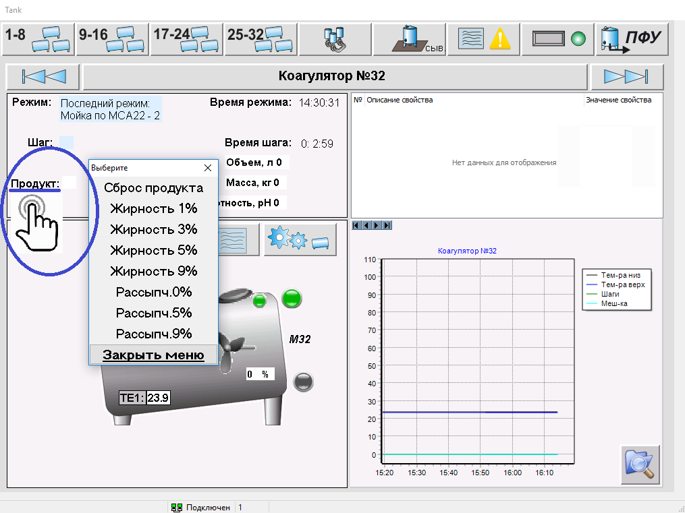
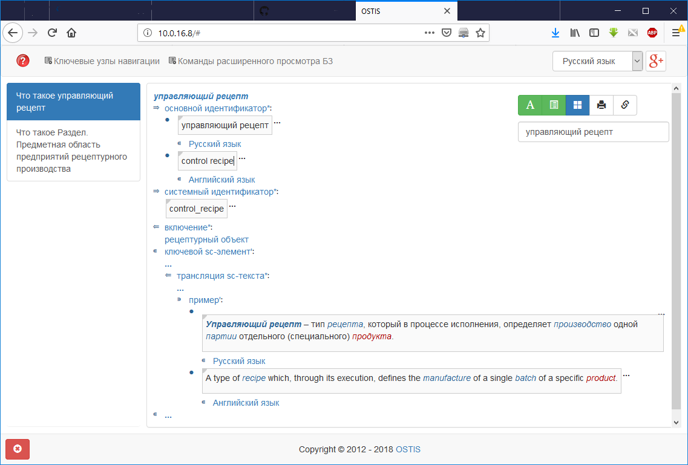
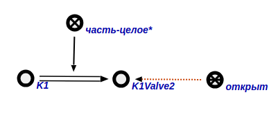
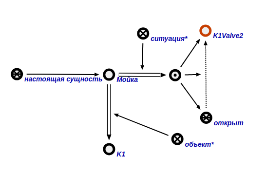
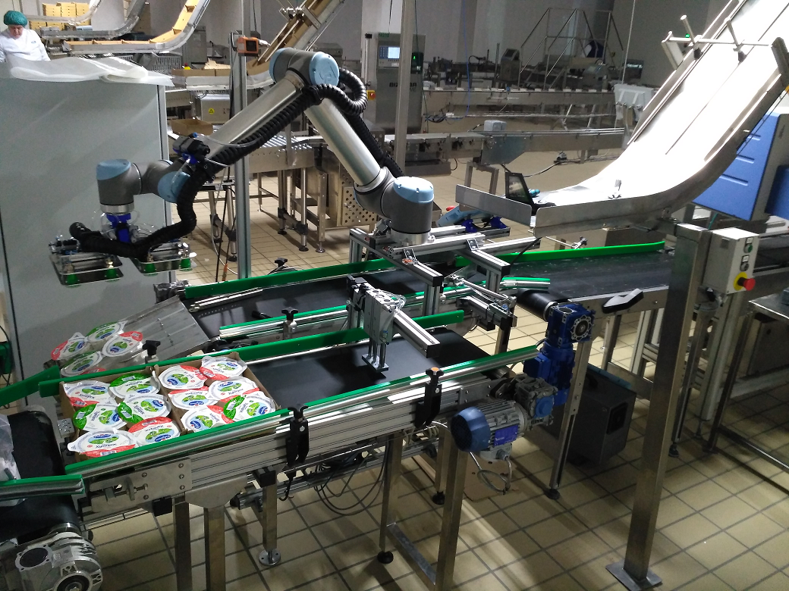
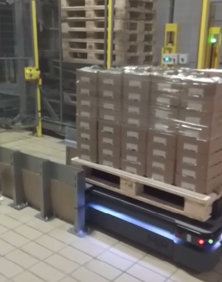
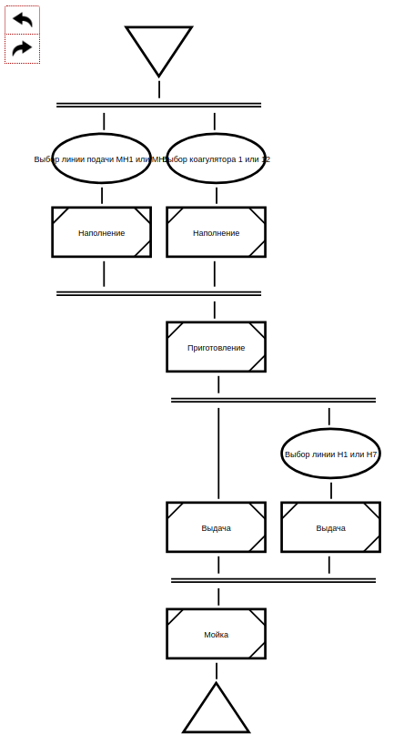
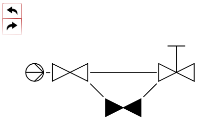
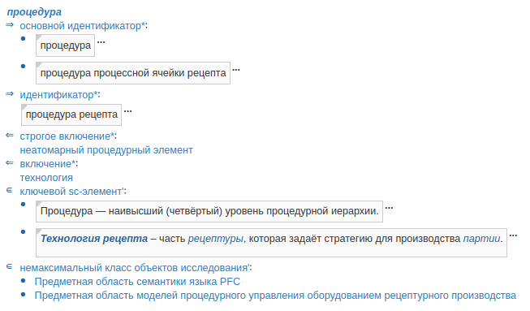
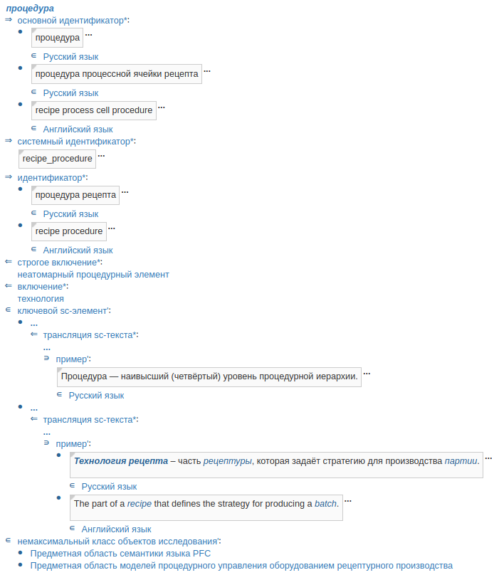

# Принципы построения системы комплексного информационного обслуживания сотрудников предприятия рецептурного производства

**Аннотация.** В данной работе ...

**Ключевые слова:** комплексная автоматизация производства, информационное обслуживание, онтологическая модель предприятия, Industry 4.0, киберфизическая система, онтология, база знаний, многоагентная система, технология OSTIS.

## 1. Введение

### 1.1 Системы информационного обслуживания

Одной из основных тенденций развития систем в области автоматизации производства и, в частности, их интеллектуализации, является переход от обособленных систем, решающих отдельные классы задач (CAD, SCADA, MES, ERP, WMS, SCM, CRM и других) к более сложным комплексным системам, осуществляющим как собственно автоматизацию процессов, происходящих на предприятии, так и информационную поддержку сотрудников и клиентов предприятия по различным классам вопросов. Так, в частности, ключевой темой международной выставки HANNOVER MESSE 2019 [HANNOVER MESSE] станет интеллектуализация производства в аспекте комплексной индустрии (Integrated Industry - Industrial Intelligence).

В области разработки такого рода систем выделяются два основных направления: PLM-системы (Product Lifecycle Management - система управления жизненным циклом изделия)\cite{Stark2015}, а также CALS-системы и технологии (Continuous Acquisition and Lifecycle Support — непрерывная информационная поддержка поставок и жизненного цикла изделий).

В данной работе внимание уделено принципам построения системы комплексного информационного обслуживания сотрудников предприятия рецептурного производства на  примере ОАО "Савушкин продукт" с использованием открытой семантической технологии проектирования интеллектуальных систем. Данная работа использует и развивает результаты, представленные авторами в работах [Savushkin2017], [Savushkin2018].

К ключевым задачам, решаемым такого рода системой в общем случае, относятся:
* формирование и поддержание актуальности единого информационного пространства на всех этапах жизненного цикла продукта;
* обеспечение согласованности информации в рамках единого информационного пространства на протяжении всего жизненного цикла;
* обеспечение возможности доступа, управления, модификации и анализа информации о продукте как сотрудниками предприятия, так и автоматизированными подсистемами;
* обучение сотрудников предприятия.

### 1.2 Особенности системы информационного обслуживания в контексте рецептурного производства

В контексте информационного обслуживания сотрудников предприятий рецептурного производства (на примере ОАО "Савушкин продукт") можно выделить следующие основные этапы жизненного цикла продукции (упрощенный вариант):

1. сбор молока на ферме;
2. доставка молока с фермы на молокозавод;
3. обработка молока на молокозаводе и получение готового продукта;
4. розлив и упаковка продукта;
5. доставка продукта на склад;
6. доставка продукции со склада завода на склад заказчика (магазина, торговой сети и т.п.).

В свою очередь, можно выделить следующие категории пользователей комплексной системы информационного обслуживания в соответствии с выполняемыми функциями:

1. оператор на линии - управление конкретным технологическим процессом;
2. мастер цеха - управление работой цеха;
3. начальник производства - управление работой производственной площадки;
4. водитель - доставка сырья\\готовой продукции;
5. производственный логист - размещение производственных заказов, контроль их выполнения;
6. транспортный логист - размещение транспортных заказов, контроль их выполнения.

### 1.3 Проблемы в области разработки систем информационного обслуживания и подходы к их решению

К основным проблемам, возникающим в процессе построения комплексных систем, способных решать рассмотренные выше задачи, можно отнести:

  * необходимость хранения и обработки разнородной информации, часто слабо структурированной, от данных, поступающих с различных датчиков, до правил и алгоритмов, задающих поведение компонентов системы в случае нештатных ситуаций;
  * необходимость, с одной стороны, комбинирования различных подходов к обработке хранимой информации, с другой стороны, постоянная необходимость модификации существующих методов обработки и добавления новых в связи с изменениями в процессах, происходящих на предприятии;
  * необходимость внесения в систему значительных изменений, связанных с открытием новых производств, изменением видов выпускаемой продукции, реорганизации структуры предприятия и т.д., при этом трудоемкость такого роа изменений должна быть минимальной.  Другими словами, должна обеспечиваться масштабируемость и модифицируемость системы.
  * необходимость стыковки между собой и с информационной системой различных устройств, часто имеющих совершенно разные интерфейсы для связи с окружающей средой;
  * востребованность большого числа вариантов отображения хранимой в системе информации, зависящих от категории пользователя, текущей решаемой задачи и других факторов.

Для решения проблемы унификации представления разнородной информации в настоящее время широко используется онтологический подход, как в области разработки программных систем \cite{Dillon2008, Emdad2008}, так и в других областях \cite{Andrichehko2012, Fedotova2016a, Fedotova2016b, Fedotova2016c}. Данный подход предполагает построение ряда онтологий, соответствующих видам описываемой в системе информации. Ниже будет подробнее рассмотрено семейство онтологий, разработанных для проектируемой в данной работе системы.

Существует ряд решений, предлагаемых компаниями-лидерами в области автоматизации, и направленных на разработку комплексных систем обслуживания предприятия. К ним относятся "Предприятие EcoStruxure" от Schneider Electric [2], "MindSphere" от Siemens [3]. Основные недостатки такого рода решений состоят в следующем:
- очень высокий порог вхождения;
- очень велика стоимость таких систем;
- системы ограничены для ознакомления, даже сам производитель часто не может чётко сформулировать перспективы развития данных систем.

Кроме того, вопросы интеграции разнородных программных и аппаратных систем решаются в рамках такого направления как интернет вещей (Internet of things). К основным проблемам в рамках данного направления относятся следующие [4]:
- есть много данных, собираемых с различных устройств, но нет методов и средств, позволяющих глубоко анализировать эти данные. Говоря другими словами, данные собираются с устройств, но нет понимания, что делать с такими данными дальше;
- необходимость стандартизации интерфейсов между различными устройствами. Решение данной проблемы значительно усложняется в случае, когда осуществляются попытки непосредственной интеграции разнородных устройств друг с другом, в этом случае потенциальное число согласований возрастает пропорционально квадрату числа классов устройств;
- проблема безопасности и санкционированности доступа.

### 1.4 Предлагаемый подход

<!-- перефразировать -->

В качестве основы предлагаемого подхода к решения поставленных проблем предлагается использовать Технологию OSTIS [Голенков]. Основные принципы построения единой информационной системы автоматизации деятельности предприятия с использованием данной технологии изложены авторами в работе [Savushkin2018]. В рамках указанного подхода предприятие предлагается рассматривать как единую информационную многоагентную систему, в рамках которой:
* вся информация объединяется в единое информационное пространство (базу знаний предприятия, которая хранится в семантической памяти);
* все участники процесса (люди, роботизированные системы, различного рода производственные комплексы и т.д.) трактуются как агенты над этой общей базой знаний. Это означает, что они (а) отслеживают интересующие их ситуации в базе знаний и реагируют на них (б) описывают результаты своей деятельности в базе знаний, для того чтобы эта информация была доступна другим агентам и они могли ее анализировать.
* база знаний системы имеет иерархическую организацию, т.е. представляет собой иерархию предметных областей и соответствующих им онтологий.
* сама многоагентная система также имеет иерархическую организацию - агенты могут объединяться в коллективы произвольной степени вложенности (членом коллектива агентов также может быть коллектив агентов). Например, группа роботизированных систем может быть логически (или даже физически) объединена в целый роботизированный комплекс, способный решать задачи определенного класса.

В контексте информационного обслуживания предложенный подход обладает рядом преимуществ, таких как:
* отсутствие необходимости разработки средств непосредственного взаимодействия компонентов системы (человек-роботизированная система, человек-человек и т.д.) за счет их взаимодействия посредством общей памяти;
* за счет того, что все агенты взаимодействуют посредством общей памяти, в общем случае для системы не важно, как физически устроен тот или иной агент. Таким образом, постепенная замена ручного труда автоматизированными системами или совершенствование таких систем не требует внесения изменений в систему;
* за счет использования общей единой базы знаний и широких возможностей ассоциативного поиска в такой базе знаний любой участник процесса производства в любой момент времени имеет доступ ко всей необходимой ему информации, а не к каким-либо заранее предусмотренным ее фрагментам, расширение числа которых может быть связано с дополнительными накладными расходами. Таким образом, существенно облегчается процесс мониторинга различных процессов и ускоряется поиск ответов на интересующие пользователя вопросы. При этом запросы пользователя к системе могут уточняться различными способами;
* одна и та же информация, хранимая в базе знаний может по-разному отображаться для различных категорий пользователей, при этом  сама информация будет оставаться неизменной, будут меняться только средства её отображения. Таким образом, отсутствует необходимость дублирования информации;

В рамках данной работы указанные принципы реализуются в контексте решения задачи информационного обслуживания, при этом основной акцент в данной работе сделан на практическую реализацию указанных принципов и демонстрацию решения некоторых из рассмотренных ранее проблем на конкретных примерах.

## 2. Архитектура системы

### 2.1 Интегрируемые компоненты

Основные производственные подсистемы (снизу вверх):
1. SCADA
2. MES, WMS
3. ERP

Они выполняют свои классические функции (более или менее успешно в текущей их реализации). Будет дополнено более детальным описанием.

### 2.2 Архитектура предлагаемой системы

Кратко об общей архитектуре системы. Выделить подсистемы.
Сказать, что переход к единой системе будет происходить постепенно, в текущий момент интегрируются разнородные подсистемы.

### 2.3 Состав базы знаний и решателя задач предлагаемой системы

Состав базы знаний: Перечислить онтологии, необходимые для построения системы.

Классы агентов (неатомарные агенты), до какой-то степени детализации, на основе функций представленных выше. (инф. поиск, интеграция)

### 2.4 Структура интерфейса системы

Интерфейс системы информационного обслуживания можно разделить на две части:
* пользовательский Интерфейс, обеспечивающий доступ сотрудников различных категорий к требуемой информации в требуемом виде;
* интерфейс системы с существующими подсистемами автоматизации в рамках предприятия (доступ к конечным устройствам не нужен, так как на данном уровне эта информация может быть получена через соответствующую подсистему - например, SCADA-систему).

## 3. Реализация системы

В данном разделе рассмотрим конкретные примеры реализации предложенных ранее принципов в рамках различных подсистем разрабатываемой системы.

### 3.1 Реализация SCADA-подсистемы
Основной задачей подсистемы информационного обслуживания, связанной с текущей реализацией SCADA-системы, является предоставление в интерактивном режиме различной справочной информации об объектах и понятиях, используемых в SCADA-системе. Данная подсистема в первую очередь ориентирована на обслуживание мастера и начальника цеха.

В текущей реализации принцип работы системы заключается в следующем: в рамках интерфейса SCADA-системы присутствуют интерактивные элементы, которым однозначно соответствуют объекты и понятия в базе знаний системы информационного обслуживания (в настоящее время связь устанавливается через основной русскоязычный идентификатор [IMS]). При взаимодействии пользователя с интерактивным элементом в рамках SCADA-системы отправляется запрос к системе информационного обслуживания, содержащий идентификатор запрашиваемого элемента, после чего система отображает семантическую окрестность запрашиваемого элемента в текущем состоянии базы знаний.

В качестве примера рассмотрим фрагмент SCADA-системы "Хуторок". Пользователь (мастер) хочет получить дополнительную справочную информацию о текущем управляющем рецепте. Для этого он нажимает на соответствующую кнопку в проекте (рисунок Х1), после чего в браузере отображется ответ на запрос семантической окрестности понятия "управляющий рецепт" на языке SCn (рисунок Х2).

Рисунок - Запрос в SCADA-системе

Рисунок - Ответ системы информационного обслуживания

Другой вариант использования системы информационного обслуживания мастером заключается в выявлении причин сложившейся ситуации (как штатной, так и нештатной). В текущей версии системы для решения данной задачи в составе решателя задач системы информационного обслуживания реализован Абстрактный sc-агент поиска причин текущего состояния заданного объекта. Указанный sc-агент находит в базе знаний все действия, в результате выполнения которых было изменено состояние объекта, являющегося аргументом запроса.

Пример работы данного sc-агента приведен на рисунках Х1 и Х2. Клапан K1Valve2 является частью коагулятора K1 и в настоящий момент открыт (рисунок Х1). После задания вопроса система в результате работы sc-агента выдает ответ о том, что клапан открыт, поскольку в данный момент для коагулятора K1 выполняется операция мойки (рисунок Х2).

Рисунок - Связь клапана и коагулятора

Рисунок - Причина открытия клапана

### 3.2 Реализация подсистемы по логистике

Основной задачей  подсистем по логистике является обеспечение эффективного  взаимодействия собственно производства, склада и транспорта.

В качестве примера работы подсистемы по логистике рассмотрим задачу контроля выполнения производственной партии продукции (может перефразировать как-то?).

Существует ряд этапов, связанных с приготовлением и доставкой партии товаров заказчику, а именно:
* приготовление партии продукта;
* охлаждение продукта на складе;
* погрузка продукта на транспорт;
* доставка продукта транспортом заказчику.

Любое ожидание и простои (ожидание приготовления, охлаждение продукта и простои машины во время ожидания загрузки) увеличивают себестоимость продукции. Таким образом, для минимизации расходов необходимо, с одной стороны, обеспечить минимальную задержку между указанными этапами, с другой стороны - при возникновении задержек оперативно изменять времена начала следующих этапов.

В свою очередь перечисленные этапы могут делиться на более простые. Например, приготовление партии заключается в выполнении одного или нескольких рецептов на производственных аппаратах (в соответствии с S88), а рецепты состоят из последовательно выполняемых операций. Если операция во время выполнения по каким-либо причинам становится на паузу, то это означает, что время приготовления рецепта увеличивается.  Сведения о данном событии должны поступать в базу знаний системы информационного обслуживания, после чего могут быть использованы для автоматической или ручной оценки критичности ситуации и, при необходимости, корректировки дальнейших этапов.

Например, если задержка превышает определенную величину, то необходимо отложить время загрузки данной партии для доставки заказчику, в противном случае машина приедет и будет ожидать, пока продукт охладиться на складе. Система информационного обслуживания  может отслеживать такие ситуации и, в случае необходимости, изменять время выезда машины на склад для погрузки с учетом нового времени готовности партии.

Пример правила в базе знаний, описывающего такого рода корректировку, представлен на рисунке Х.

КАРТИНКА

### 3.3 Реализация робототехнической подсистемы

Линия производства творогов на данный момент включает в себя два роботизированных узла: узел упаковки продукта в короба с помощью коллаборативного робота и узел транспортировки паллет с готовым продуктом в приемный порт склада на основе мобильного робота.
Рассмотрим задачу упаковки творогов в короба коллаборативным роботом. Общая схема установки приведена на рисунке ниже.

Установка получает на вход поток творогов, который затем разделяется и формируется в группы по 12 шт. Робот с помощью захватного механизма забирает партию и укладывает в две коробки. Упаковка творога допускается в два типа коробок: одноуровневые по 6 шт. и по двухуровневые по 12.  Далее коробки по выходному транспортеру выдаются на узел паллетизации. Для работы системы роботу необходима следующая информация от семантической системы управления:
1. Текущая производительность линии
2. Тип подаваемой коробки
3. Отсутствие коробок на входе
4. Состояние соседних с роботом узлов производственной линии (Работает, не работает, не исправен, авария)
5. Время планового обслуживания захватного механизма
На основе данной информации ПО робота гибко реагирует на текущие параметры всего производственного процесса. Подстраивая скорость и задержки в выполнении операций робот динамически управляет производительностью ячейки, чтобы не создавать очередей на входном и выходном конвейере. Тип подаваемой коробки определяет количество продукта, которое роботу необходимо уложить в нее. Состояние соседних узлов производственного процесса позволяет роботу переключить процесс упаковки в режим ручной обработки или пустить продукт во временный накопитель.
Рассмотрим задачу транспортировки готового продукта на склад с помощью мобильного робота. Вид робота приведен на рисунке ниже.

Мобильный робот оперирует понятием миссии, которая состоит из точки забора продукта, маршрута доставки и точки выгрузки. После запуска производственного процесса робот занимает позицию погрузки или ожидает внешнего сигнала о том, что паллета заполнена. После этого робот приступает к процессу загрузки паллеты на борт. Далее основываясь на доступной карте помещения, динамической обстановке в цеху с соблюдением норм безопасности робот передвигается с паллетой до приемного порта, где при наличии свободного места осуществляет разгрузку.
Семантическая система управления конструирует для робота миссии, решая следующие задачи:
1. Создание расписания для вывоза продукта с нескольких линий с учетом производительности их и робота.
2. Выбор времени зарядки мобильного робота в моменты простоя.
3. Определение уровня безопасности по уровню текущей динамической ситуации в цехе.

### 3.4 Реализация пользовательского интерфейса системы

Основным требованием, предъявляемым к пользовательскому интерфейсу системы информационного обслуживания является возможность визуализации информации из базы знаний как при помощи универсальных языков (для "продвинутого пользователя"), так и с помощью специализированных языков, ориентированных на отображение информации определенного вида и удобных для конкретных категорий пользователей. Кроме того, при расширении функционала системы существует и необходимость расширения числа используемых внешних языков.

Подход к разработке средств, позволяющих легко расширять перечень специализированных внешних языков, используемых компьютерной системой, разработанной на основе Технологии OSTIS, рассмотрен в работе [Борискин 2018 или раньше]. Указанный подход предполагает разработку для каждого внешнего языка трех онтологических моделей: семантической модели текстов языка, синтаксической модели текстов языка и модели перехода от семантической модели к синтаксической в виде онтологии правил перехода.

В текущей версии системы информационного обслуживания используются два внешних языка визуализации - язык PFC для визуализации процедурных моделей предприятия и язык P&ID для визуализации физических моделей предприятия. В работе [савушкин 2018] рассмотрены примеры формализации онтологических моделей для языка PFC. В текущей версии системы были реализованы средства визуализации диаграмм языка PFC и P&ID. Примеры работы средств приведены на рисунках Х1 и Х2 соответственно.

Рисунок - Пример отображения диаграммы PFC

Рисунок - Пример отображения диаграммы P&ID

Кроме того, для облегчения работы с системой неподготовленных пользователей был разработан упрощенный режим визуализации для языка SCn, в котором скрывается часть информации, необходимая только для разработчика. Режим визуализации, при котором отображается вся известная информация, был назван "экспертным режимом", и был добавлена возможность переключения между режимами (рисунок Х1 и Х2 на примере описания понятия процедура).

Рисунок - Отображение информации в упрощенном режиме

Рисунок - Отображение информации в экспертном режиме

### 3.5 Проблемы при разработке системы

1. Необходимо реализовать возможность пользователю (инженеру по автоматизации) вносить изменения в базу знаний. Сейчас это реализовано через правку текстов (sc), что не является удобным.  
2. Необходимость доработки графического представления: в инженерной документации всё имеет значение (толщина, цвет и изломы линии), в текущей реализации это немного упрощено. Надо обеспечить соответствие стандартам.  
3. Сложность разработки - инженерная область сложна, область разработки интеллектуальных систем также - здесь же необходимо обеспечить их совместную работу - сложность такого взаимодействия многократно увеличивается.

## Заключение

## Библиографический список

1. [HANNOVER MESSE] (2018, Dec.) Integrated Industry - Industrial Intelligence [Online]. – Available: https://www.hannovermesse.de/en/news/key-topics/integrated-industry/index-2.xhtml
2. [EcoStruxure] (2018, Dec.) EcoStruxure is IoT-enabled, plug-and-play, open, interoperable architecture and platform, in Homes, Buildings, Data Centers, Infrastructure and Industries. [Online]. – Available: https://www.schneider-electric.ru/ru/work/campaign/future-of-automation/smart-industrial-automation.jsp
3. [MindSphere] (2018, Dec.) MindSphere is the cloud-based, open IoT operating system from Siemens that connects your products, plants, systems, and machines, enabling you to harness the wealth of data generated by the Internet of Things (IoT) with advanced analytics. [Online]. – Available: https://www.siemens.com/global/en/home/products/software/mindsphere.html.
4. [IoT] (2018, Dec.) 7 Big Problems with the Internet of Things. [Online]. – Available: https://www.cmswire.com/cms/internet-of-things/7-big-problems-with-the-internet-of-things-024571.php
