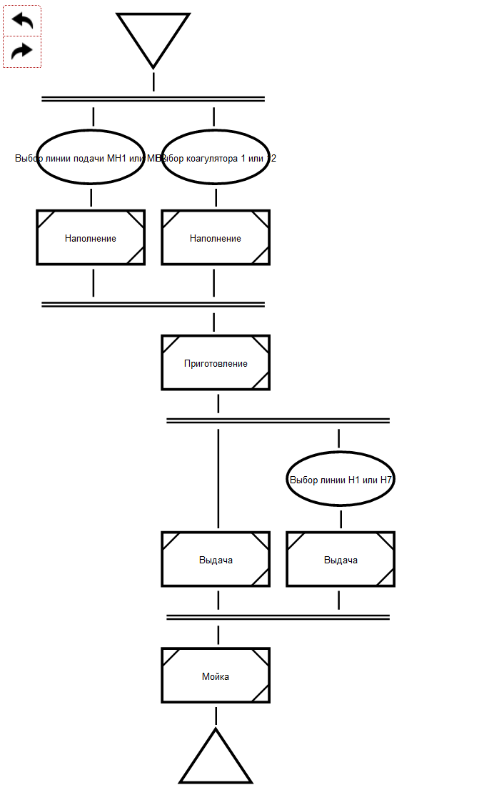

# Эффективное использование стандартов в концепции Industry 4.0

**Аннотация.**  В данной работе предлагается подход к автоматизации процессов создания, развития и применения стандартов на основе Технологии OSTIS. Рассмотрены проблемы современных подходов к организации указанных процессов, показана роль стандартов в рамках концепции **Industry 4.0**, приведены примеры формализации стандартов в рамках предлагаемого подхода.

**Ключевые слова:**

## 1. Введение
В основе каждой развитой сферы человеческой деятельности лежит ряд стандартов, формально описывающих различные ее аспекты - систему понятий (включая терминологию), типологию и последовательность действий, выполняемых в процессе применения соответствующих методов и средств, модель объекта производства, вид и состав проектной документации, сопровождающей деятельность и многое другое.

Наличие стандартов позволяет решить одну из ключевых проблем, актуальную для любых технологий, в особенности для бурно развивающихся компьютерных информационных технологий, - проблему совместимости [Голенков, 2019]. Совместимость может рассматриваться в различных аспектах, начиная от согласованности терминов при взаимодействии участников процесса и заканчивая согласованностью действий, выполняемых в процессе использования технологии, что, в свою очередь, позволяет гарантировать совпадение результата при выполнении одних и тех же действий разными исполнителями.

Несмотря на развитие информационных технологий, в настоящее время подавляющее большинство стандартов представлено либо в виде традиционных линейных документов, либо в виде web-ресурсов, содержащих набор статических страниц, связанных гиперссылками. Такой подход к форме представления стандартов имеет ряд существенных недостатков, которые в конечном итоге приводят к тому, что накладные расходы на сопровождение и применение стандарта фактически превышают выгоду от его применения [Серенков, 2004].

## 2. Проблемы и предлагаемый подход

Перечислим наиболее важные и общие проблемы, связанные с развитием и применением современных стандартов в различных областях [Серенков, Углов]:

- дублирование информации в рамках документа, описывающего стандарт;
- трудоемкость сопровождения самого стандарта, обусловленная в том числе дублированием информации, в частности, трудоемкость изменения терминологии;
- проблема интернационализации стандарта - фактически перевод стандарта на несколько языков приводит к необходимости поддержки и согласования независимых версий стандарта на разных языках;
- неудобство применения стандарта, в частности, трудоемкость поиска необходимой информации. Как следствие - трудоемкость изучения стандарта;
- несогласованность формы различных стандартов между собой, как следствие - трудоемкость автоматизации процессов развития и применения стандартов;
- трудоемкость автоматизации проверки соответствия объектов или процессов требования того или иного стандарта;
- и другие.

В качестве примера можно рассмотреть стандарт **ISA 88** [ссылка] - основополагающий стандарт для партионного производства. Стандарт широко используется на предприятиях в Америке и Европе, активно внедряется и на территории Республики Беларусь, однако, имеет целый ряд недостатков, обусловленных перечисленными выше проблемами:
* американская версия стандарта - **ANSI/ISA-88.00.01-2010** - является уже обновленной, третьей редакцией от 2010 года;
* в то же время европейская версия, принятая в 1997 - **IEC 61512-1** - основывается на старой версии **ISA-88.01-1995**;
* русский вариант стандарта - **ГОСТ Р МЭК 61512-1-2016** - идентичен **IEC 61512-1**, то есть также уже устарел;
* русский вариант стандарта - **ГОСТ Р МЭК 61512-1-2016** - также вызывает целый ряд вопросов, связанный с не очень удачным переводом оригинальных английских терминов на русский язык;
* при переводе теряется смысл из-за неудачно написаного текста, неудачного перевода, трудности понимания;  
* и многие другие.

Еще один популярный стандарт в контексте industry 4.0 - **PackML** (Packaging Machine Language [ссылка]). **PackML** - это промышленный стандарт для описания систем управления фасовочными автоматами. Основное его назначение - упростить разработку таких систем, абстрагироваться от аппаратной реализации и обеспечить единый интерфейс взаимодействия с уровнями SCADA и MES. Этот стандарт определяет как программные элементы (программные модули для промышленных контроллеров), так и общие принципы разработки фасовочных линий.

Эти и другие стандарты в настоящее время распространаются в виде документов, неудобных для автоматической обработки и, как указано выше, сильно зависящих от языка, на котором написан тот или иной документ.

Перечисленные проблемы связаны в основном с формой представления стандартов. Наиболее перспективным подходом к решению перечисленных проблем является преобразование каждого конкретного стандарта в базу знаний, в основе которой лежит набор онтологий, соответствующих данному стандарту [Серенков, Углев, Голенков?]. Такой подход позволяет в значительной мере автоматизировать процессы развития стандарта и его применения.

Задачей любого стандарта в общем случае является описание согласованной системы понятий (и соответствующих терминов), бизнес-процессов, правил и других закономерностей, способов решения определенных классов задач и т.д. Для формального описания информации такого рода с успехом применяются **онтологии**. Более того, в настоящее время в ряде областей вместо разработки стандарта в виде традиционного документа разрабатывается соответствующая онтология [ссылки]. Такой подход дает очевидные преимущества в плане автоматизации процессов согласования и использования стандартов.

Однако, актуальной остается проблема, связанная не с формой, а с сутью (семантикой) стандартов - проблема несогласованности системы понятий и терминов между различными стандартами, которая актуальна даже для стандартов в рамках одной и той же сферы деятельности.

Для решения данной проблемы и перечисленных ранее проблем предлагается использовать Технологию OSTIS, одной из ключевых задач которой является решения проблемы синтаксической и семантической совместимости компьютерных систем [Голенков, 2019], в частности, совместимости различных видов знаний [Давыденко 2018] и различных моделей решения задач [Шункевич 2018].

В рамках данной работы будет рассмотрен опыт применения указанной технологии при построении информационно-справочной системы по стандарту рецептурного производства ISA-88 [https://www.isa.org/isa88/] совместно с сотрудниками ОАО “Савушкин продукт”. Изначально данная система рассматривалась как справочная и обучающая система для сотрудников предприятия, однако в настоящее время преобразуется в международный открытый проект, целью которого является создание актуальной, постоянно развиваемой и удобной в использовании базы знаний, описывающей указанный стандарт. В работе [Савушкин 2017] рассмотрена начальная версия формального описания рассматриваемого стандарта средствами Технологии OSTIS, а также представлены фрагменты формального описания подразделений самого предприятия с учетом требований стандарта.
Впоследствии часть представленных описаний, не связанная непосредственно с предприятием, была выделена в упомянутую выше отдельную систему, посвященную стандарту ISA-88. Актуальная версия системы доступна онлайн по адресу http://ostis.savushkin.by.

## 3. Стандарт ISA-88

Стандарт ISA-88 (сокращение от ANSI/ISA-88), основывается на базе разработанного ранее стандарта NAMUR N33 и помогает в решении нескольких фундаментальных проблем, таких как отсутствие единой модели рецептурного производства, сложность согласования требований, трудоемкость интеграции решений различных поставщиков, сложность управление рецептурным производством. Для решения этих проблем необходимо было определить единые модели, терминологию, структуру данных и язык описания процесса. Структура стандарта соответствует поставленным задачам и включает четыре части:

* ANSI/ISA-88.00.01-2010, Batch Control Part 1: Models and Terminology – определяет стандартные модели и терминологию для формализации требований к системам управления периодическим производством, его эквивалент – IEC 61512 1;
* ANSI/ISA 88.00.02 2001, Batch Control Part 2: Data Structures and Guidelines for Languages – определяет модели данных для управления производством, структуры данных для обмена информацией, а также форму записи рецептуры;
* ANSI/ISA 88.00.03 2003, Batch Control Part 3: General and Site Recipe Models and Representation – определяет модели для представления обобщенных рецептур и обмена такими рецептурами между подразделениями предприятия, а также между предприятием и его партнерами;
* ANSI/ISA 88.00.04 2006, Batch Control Part 4: Batch Production Records – определяет модели данных и ориентировочную модель системы для записи, хранения, извлечения и анализа данных о ходе периодического производства.

## 4. Архитектура системы и примеры использования

В качестве основы для автоматизации процессов создания, развития и применения стандартов предлагается использовать Технологию OSTIS и соответствующий набор моделей, методов и средств разработки семантически совместимых интеллектуальных систем. В основе Технологии OSTIS лежит унифицированный вариант кодирования информации на основе семантических сетей с базовой теоретико-множественной интерпретацией, названный SC-кодом [Голенков 2019]. 

Применение SC-кода и моделей представления различных видов знаний, построенных на его основе, позволит обеспечить такие возможности как:
- автоматизация процессов согласования стандартов распределенным коллективом авторов [Голенков 2019-2];
- возможность фиксации противоречивых точек зрения на одну и ту же проблему в процессе обсуждения и даже в процессе применения разрабатываемого стандарта [Голенков 2019-2];
- возможность эволюции стандарта непосредственно в процессе его применения;
- отсутствие дублирования информации на семантическом уровне;
- независимость системы понятий от терминологии, как следствие - от естественного языка, на котором изначально создавался стандарт;
- возможность автоматизации процессов верификации стандартов, в том числе выявления противоречий, информационных дыр, логических дублирований и т.д.;
- повышение эффективности использования стандарта, обеспечение возможности решать различные задачи без необходимости преобразования стандарта в какой-либо другой формат, в частности, возможность автоматизации процесса проверки соответствия чего-либо необходимым стандартам;
- и другие.

Архитектура каждой системы, построенной по Технологии OSTIS (ostis-системы), включает платформу интерпретации семантических моделей ostis-систем, а также семантическую модель osits-системы, описанную при помощи SC-кода (sc-модель ostis-системы). В свою очередь, sc-модель ostis-системы включает sc-модель базы знаний, sc-модель решателя задач и sc-модель интерфейса (в частности, пользовательского). Принципы устройства и проектирования баз знаний, решателей и интерфейсов ostis-систем более подробно рассмотрены в работах [Давыденко, 2018], [Шункевич, 2018], [Борискин, 2017] соответственно.

Рассмотрим более подробно состав каждого из перечисленных выше компонентов в рамках рассматриваемой системы по стандарту ISA-88.

### 4.1 База знаний системы

В основе sc-модели базы знаний любой ostis-системы лежит иерархическая система предметных областей и соответствующих им онтологий. В рамках указанной системы выделяется Ядро sc-моделей баз знаний, включающее семейство предметных областей верхнего уровня [Давыденко 2018]. Такой подход позволяет обеспечить совместимость различных видов знаний в любой ostis-системе, а также существенно сократить время на разработку конкретной базы знаний.

В рамках рассматриваемой системы, выделен следующий набор предметных областей,
соответствующих стандарту ISA-88 (рис. <>):


Каждая предметная область имеет соответствующую структурную спецификацию, включающую перечень исследуемых в рамках данной области понятий (рис. <>):


В свою очередь, каждое понятие стандарта описывается с необходимой степенью детализации (рис. <>):


Кроме того, важным преимуществом использования Технологии OSTIS для разработки системы такого рода является наличие методики и средств коллективной разработки баз знаний [Давыденко 2018], которые позволяют осуществлять развитие стандарта, представленного в виде базы знаний, распределенным коллективом разработчиков.

### 4.2 Решатель задач системы

Решатель задач любой ostis-системы представляет собой иерархическую систему агентов, взаимодействующих между собой исключительно посредством семантической памяти этой ostis-системы (sc-агентов). Такой подход позволяет обеспечить модифицируемость решателя и возможность интеграции различных моделей решения задач в рамках одного решателя.
В контексте системы по стандарту ISA-88 актуальной задачей является поиск сотрудниками предприятия необходимой информации, от определений некоторых понятий, до установления сходств и различий между указываемыми сущностями. Данная задача актуальна как для опытных сотрудников, так и для новых сотрудников, которые впервые знакомятся со стандартом. При этом важным аспектом является возможность задавать вопросы в виде, понятном для пользователя, не обязательно знакомого с внутренним устройством ostis-системы.
Используемый подход к построению баз знаний и решателей задач позволяет унифицировать принципы обработки информации, и, как следствие, уменьшить количество необходимых sc-агентов. Так, например, вопросы вида

- "Какие подклассы есть у заданного класса?";
- "На какие компоненты делится указанная сущность?";
- "Из каких частей состоит заданный объект?";
- "Какие бывают разновидности заданной сущности?";
- и т.п.

могут быть сведены к обобщенному вопросу "Какие сущности являются частными по отношению к заданной сущности?", для обработки которого, таким образом, достаточно реализовать всего один sc-агент. Однако, это не запрещает иметь в рамках пользовательского интерфейса набор более специализированных команд с именами, понятными конечному пользователю, но в рамках системы реализуемых в универсальном ключе.

### 4.3 Пользовательский интерфейс системы

Важнейшим компонентом для системы, описывающей некоторый стандарт, является пользовательский интерфейс, качество которого во многом определяет эффективность использования системы. Пользователями системы чаще всего являются сотрудники, далекие от семантических технологий, а часто и информационных технологий вообще, в связи с чем актуальной является задача построения интерфейса, который, с одной стороны, был бы прост в использовании и нагляден, с другой стороны - обладал универсальностью, необходимой для отображения различных видов знаний.
По умолчанию ответы системы пользователю отображаются в SCn-коде, который является гипертекстовым вариантом внешнего отображения текстов SC-кода и может читаться как линейный текст.

Информация на рисунках <взять рисунки выше> отображена в виде SCn-текстов в режиме, предназначенном для конечного пользователя. Для более опытного пользователя предусмотрен также режим с более подробным отображением информации. Особенности указанных режимов детальнее рассмотрены в статье [Савушкин2019].

Важной особенностью SC-кода является четкое разделение внутреннего знака, обозначающего некоторую сущность, и термина либо другого внешнего идентификатора, соответствующего данной сущности. Благодаря этой особенности каждой сущности может быть поставлено в соответствие произвольное количество внешних идентификаторов, что, в свою очередь, легко позволяет обеспечить мультиязычность стандарта без необходимости дублирования информации.
Так, для текущей версии системы по стандарту ISA-88 оказалось актуальным наличие версий системы на русском, английском, украинском и немецком языках. На рис <> представлены соответствующие варианты стартовой страницы системы на указанных языках. Как видно из представленных примеров, изменяются только отображаемые термины, структура же информации остается неизменной.


Кроме того, средства Технологии OSTIS позволяют хранить и, что очень важно, специфицировать в рамках базы знаний любые внешние файлы, например, изображения, документы и т.д. На рисунке <> представлено описание в базе знаний изображения процедуры на языке PFC, являющемся часть стандарта ISA-88.


Таким образом, предлагаемый подход позволяет описывать также синтаксис и семантику внешних языков, за счет чего обеспечивается возможность построения унифицированных средств визуализации не только для универсальных языков (вариантов внешнего отображения текстов SC-кода), но и для специализированных языков, таких как язык PFC. На рисунке <> представлено изображение диаграммы на языке PFC, к элементам которой можно задавать различные вопросы, как и к любым другим элементам в рамках базы знаний.



### 4.4 Интеграция сторонних решений с базой знаний

Система по стандарту, построенная на основе Технологии OSTIS может легко интегрироваться с другими системами на производстве. Для интеграции системы по стандарту ISA-88 с другими системами, работающими на ОАО "Савушкин продукт", используется WEB-ориентированный подход - обращение к серверу с ostis-системой происходит с помощью запросов следующего вида:

```
http://ostis.savushkin.by?sys_id=procedure
```

где `sys_id=procedure` определяет термин (имя какой-либо сущности), значение которого мы хотим узнать (в данном примере, по сути, ответ на вопрос "Что такое "технология"? ). такой подход позволяет позволяет относительно легко добавить поддержку базы знаний для текущих проектов АСУТП, для этого достаточно в рамках АСУТП указать имена, соответствующие сущностям в базе знаний. Таким образом, реализована интерактивная интеллектуальная справочная система для проектов АСУТП, позволяющая сотрудникам одновременно работать с АСУТП и задавать вопросы к системе непосредственно в процессе работы.

Ниже приведены иллюстрации отображения информации в виде мнемосхемы ЧМИ (из проекта АСУТП):


 Далее веб-страница с отображающей ту же информацию в виде PFC-схемы (из базы знаний):


## Заключение

В работе рассмотрен подход к автоматизации процессов создания, развития и применения стандартов на основе Технологии OSTIS. На примере стандарта ISA-88, применяемого на предприятии ОАО "Савушкин продукт", рассмотрена структура базы знаний, особенности решателя задач и пользовательского интерфейса системы поддержки указанных процессов. Показано, что разработанная система легко может интегрироваться с другими системами предприятия, являясь основой для построения системы информационного обслуживания сотрудников предприятия в контексте Industry 4.0.

Предложенный в работе подход позволяет обеспечить не только возможность автоматизации процессов создания, согласования и развития стандартов, но и позволяет значительно повысить эффективность процессов применения стандарта, как в ручном, так и в автоматическом режиме.

## Библиографический список

1. Концепция инфраструктуры стандартизации как базы знаний на основе онтологий / П. С. Серенков [и др.] // Новости. Стандартизация и сертификация. - 2004. - № 5. - С. 25 - 29.
2. В.А. Углев АКТУАЛИЗАЦИЯ СОДЕРЖАНИЯ СТАНДАРТОВ ПРОЕКТИРОВАНИЯ СЛОЖНЫХ ТЕХНИЧЕСКИХ ОБЪЕКТОВ: ОНТОЛОГИЧЕСКИЙ ПОДХОД ОП 1-2012
3. Ontology-based standards development: Application of OntoStanD to ebXML business process specification schema. Bahareh Rahmanzadeh Heravi, Mark Lycett, Sergio de Cesare https://doi.org/10.1016/j.accinf.2014.01.005
4. El-Sappagh, Shaker et al. “SNOMED CT standard ontology based on the ontology for general medical science.” BMC medical informatics and decision making vol. 18,1 76. 31 Aug. 2018, doi:10.1186/s12911-018-0651-5 https://dx.doi.org/10.1186%2Fs12911-018-0651-5
