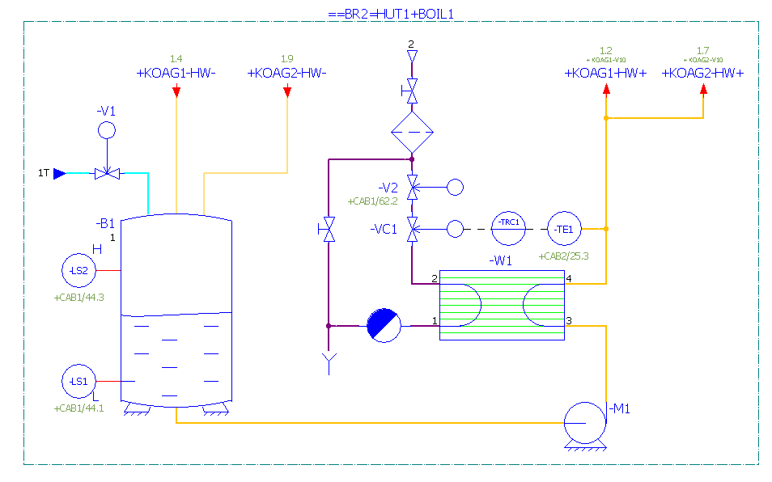

# Piping and Instrumentation Diagram/Drawing (P&ID) #
## О языке ##

Язык P&ID основывается на International Society of Automation (ISA) Standard S5.1 и предназначен для описания диаграмм, которые показывают взаимосвязь технологического оборудования и приборов, используемых для управления процессом.  
Основной чертеж или схема на языке P&ID используются для изображения установки управления технологическими процессами.

## Элементы P&ID ##

Рассмотрим элементы схем, которые необходимы для составления узла нагрева.

| Номер | Символ                                              | Описание       |
| ----- |:---------------------------------------------------:| :--------------|
| 1     |                      | Трубопровод   (pipe). |
| 1     |    | Нормально закрытый двухходовой клапан   (generic two-way normally open valve). |
| 2     |    | Нормально открытый двухходовой клапан   (generic two-way normally closed valve).|
| 3     |     | Ручной нормально закрытый двухходовой клапан   (generic two-way normally closed valve with manual actuator).|
| 4     |      | Ручной нормально открытый двухходовой клапан   (generic two-way normally closed valve with manual actuator).|
| 5     |      | Нормально открытый двухходовой клапан с активатором  (generic actuator normally open valve).|
| 6     | | Измерительное устройство   (instrumentation device).|
| 7     |     | Вертикальный танк   (vertical vessel).|

## Узел нагрева ##

Упрощенная P&ID-схема узла нагрева.

Полная P&ID-схема узла нагрева.

