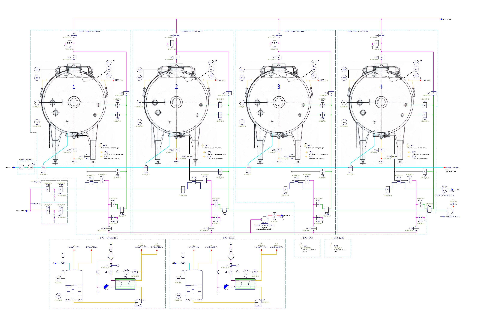

# Проект "Хуторки" #
## Мастер рецепт (*master recipe*) ##
Схема для мастер-рецепта приготовления творога Хуторок:

 

## Рецептурная процедура (*recipe procedure*) ##

Схема рецептурной процедуры для приготовления творожной массы:

## Аппаратная процедура (*unit procedure*) ##

Схема аппаратной процедуры для приготовления творожной массы:

 

Схема операционной процедуры для операции **"Отделение сыворотки"**:

 

Схема операционной процедуры для операции **"Откачка сыворотки"**:

 

## P&ID cхемы ##  

P&ID схема коагуляторов 1-4: 
 
