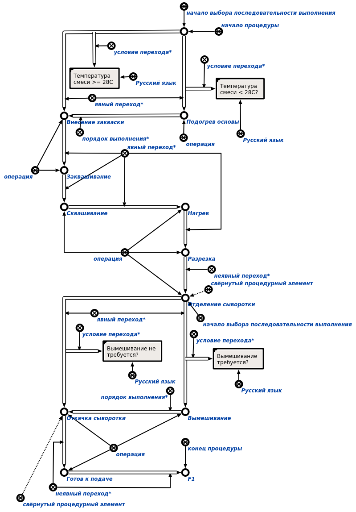
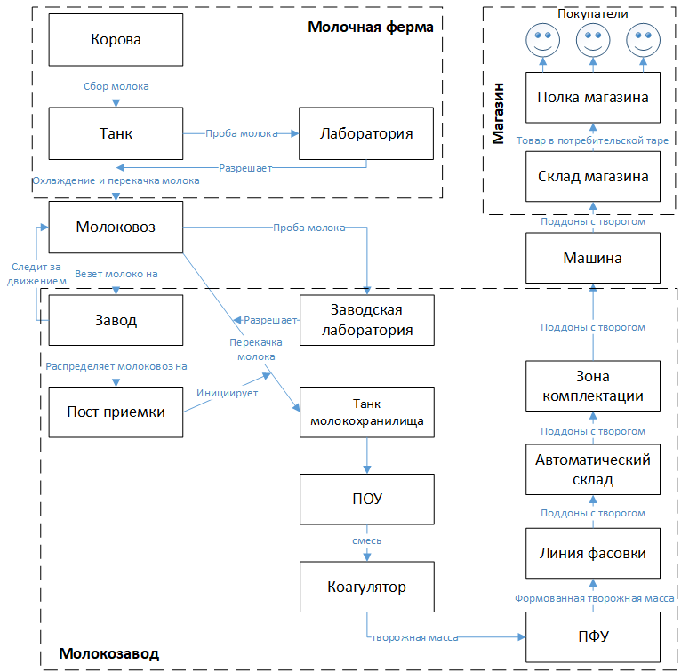
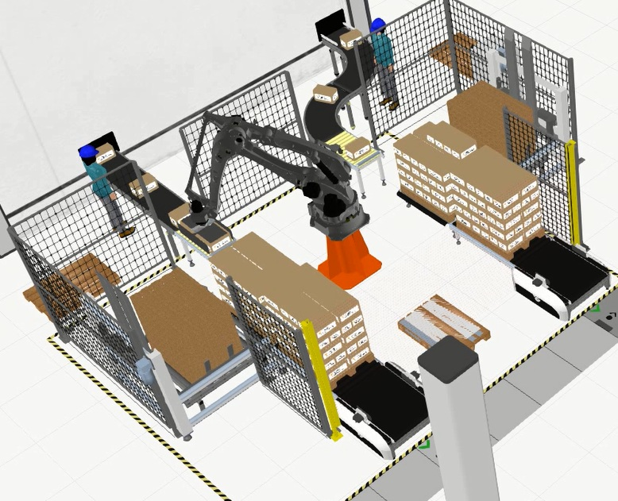
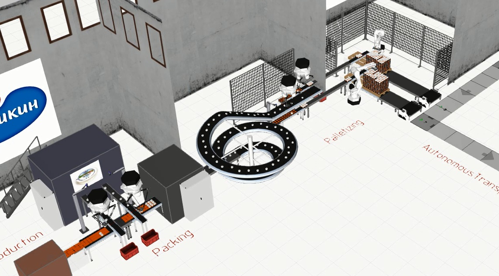

# ПРОЕКТИРОВАНИЕ ПРЕДПРИЯТИЯ РЕЦЕПТУРНОГО ПРОИЗВОДСТВА В КОНТЕКСТЕ КОНЦЕПЦИИ INDUSTRY 4.0

**Аннотация.** В данной работе рассматривается усовершенствованный подход к онтологическому проектированию предприятий рецептурного производства, использующий принципы, разработанные в рамках концепции Industry 4.0.

**Ключевые слова:** автоматизация производства, промышленный интернет вещей, индустрия 4.0, киберфизические системы.

## 1. Введение
Данная статья рассматривает дальнейшее развитие автоматизации предприятий рецептурного производства на примере ОАО "Савушкин продукт". Оно состоит в переходе от рассмотрения производственных процессов, происходящих в рамках конкретного предприятия, к рассмотрению полного продуктового цикла - от получения заявки от магазина-клиента до ее выполнения (удовлетворения запроса потребителя). Данный процесс, кроме самого предприятия, включает в качестве субъектов молочные фермы, логистические службы, магазины и др. Также даже в рамках одного предприятия на сегодняшний день используются разрозненные системы (несколько SCADA-систем, система управления транспортом, система управления складом и др.). Стыковка таких систем и поддержка согласованности информации в них осуществляется вручную (либо опускается). Сейчас существует потребность автоматизировать согласование информации и обеспечить, там где это уместно, взаимодействие устройств на разных этапах продуктового цикла. Наличие такой потребности привело к появлению инициативы Industry 4.0 в Германии и ей аналогичных в других странах мира.

Таким образом, целью работы является развитие предложенной в [Савушкин, 2017] онтологической модели предприятия рецептурного производства для расширения круга описываемых этапов производства, в том числе и не происходящих непосредственно на предприятии, и учитывающее результаты, полученные в рамках инициативы Industry 4.0.

### 1.1 Концепция Industry 4.0
Концепция Industry 4.0 была сформулирована в Германии в 2011 году. Она подразумевает создание и внедрение в производство т.н. киберфизических систем (КФС) и использование интернета вещей и услуг в производственных процессах [9]. Стоит отметить, что термин специфичен для Германии и за ее пределами используется редко. Аналогичные концепции в других странах называются по-разному - "умная фабрика" (Нидерланды), "фабрика будущего" (Италия), "промышленный интернет" (США).

Основные принципы концепции Industry 4.0 [DesignPrinciples 2016]:

- **Взаимодействие**. Возможность взаимодействия устройств, датчиков, людей посредством Интернета вещей (IoT), Интернета людей (IoP), Интернета услуг (IoS).
- **Виртуализация**. Означает способность киберфизической системы контролировать физические процессы. Данные сенсоров проецируются на модель предприятия, включающих состояние всех киберфизических систем. В случае возникновения нештатной ситуации должна быть возможность уведомить оператора, предоставив ему информацию по ее устранению и обеспечению безопасности, тем самым осуществляя поддержку принятия решений персоналом.
- **Децентрализация**. Растущая потребность в штучных партиях заказных продуктов увеличивает сложность централизованного управления производством. КФС могут иметь встроенные вычислительные модули, позволяющие им принимать решения самостоятельно и переадресовывать задачу управляющей системе только в случае необходимости. Несмотря на это, необходимо обеспечить контроль качества конечного продукта и прослеживаемость, что требует централизованного управления. К примеру, необходимые шаги производственного процесса могут быть закодированы в RFID-метках, что освобождает от необходимости централизованного управления данным аспектом производства малых партий продукта.
- **Анализ и реагирование в реальном времени**. С целью управления производством необходимо, чтобы данные с сенсоров постоянно собирались и анализировались в режиме реального времени. В случае отказа одной производственной установки, можно "перепоручить" её задачу другой.
- **Ориентированность на услуги**. Услуги компаний, КФС и людей доступны в Интернете услуг и могут быть использованы другими участниками. Услуги могут предоставляться как внутри предприятия, так и другим предприятиям. КФС предоставляют свои услуги в виде веб-служб. Это позволит реализовать производство продукта путем комбинирования производственных операций в соответствии со спецификацией клиента, закодированной, например на RFID-метке.
- **Модульность**. Система должна быть гибко адаптируема к меняющимся требованиям (например, сезонным изменения в потреблении, изменению характеристик продукта или производства). Адаптация должна осуществляться заменой или расширением отдельных компонентов системы. Обеспечение совместимости компонентов требует наличия стандартизированных механизмов взаимодействия, позволяющих автоматически идентифицировать компоненты и включать их в интернет услуг.

Под киберфизической системой понимается совокупность интеллектуальных, легко интегрируемых физических компонентов со встроенными в них вычислительными ресурсами, тесно взаимодействующих между собой и отслеживающих изменения в состоянии внешнего мира [10].

Для построения киберфизической системы необходима интеграция вычислительных ресурсов и физико-технических процессов. Сенсоры, манипуляторы, информационные и управляющие системы должны взаимодействовать между собой на всех этапах производства, в том числе и выходящих за рамки одного конкретного предприятия [4].

Внедрение новых систем автоматизации, в том числе интеллектуальных, на предприятии должно основываться на уже имеющихся у предприятия ресурсах  [Galbrecht 2017].

Потребность в комплексной автоматизации сложных процессов, требующих согласованной работы множества служб и технических средств, создает потребность в разработке подобных систем. В дальнейшем будем рассматривать повышение уровня автоматизации предприятий рецептурного производства с точки зрения разработки прототипа киберфизической системы для ОАО “Савушкин продукт”.

Разрабатываемый прототип должен обеспечивать комплексную автоматизацию процесса производства молочных продуктов от доения коровы до поступления готовой продукции в магазин. В этом процессе можно выделить три основные стадии:
- От доения коровы до поступления молока на завод.
- Обработка молока на заводе.
- Доставка готовой продукции с завода в магазины.

### 1.2. Проблемы

Основной проблемой, возникающей при разработке системы комплексной автоматизации является проблема интеграции различных компонентов системы и обеспечения взаимодействия между ними. Решение данной проблемы традиционным способом, предполагающим разработку средств коммуникации между разнородными компонентами системы (интерфейсов, протоколов и т.д.) с одной стороны, приводит к существенным накладным расходам, связанным с разработкой таких средств, с другой стороны - сильно усложняет архитектуру такой системы, значительно повышая трудоемкость ее сопровождения и развития. Очевидно, что постоянное развитие технологий производства на различных его этапах и расширение самого производства обуславливает требование гибкости к системе автоматизации, то есть способности легко дополнять ее различными компонентами и модифицировать уже существующие компоненты при необходимости.

Для решения перечисленных проблем предлагается развитие идей онтологического подхода к проектированию предприятий на основе Технологии OSTIS [Савушкин 2017]. Предприятие предлагается рассматривать как единую информационную многоагентную систему, в рамках которой:

* вся информация объединяется в единое информационное пространство (базу знаний предприятия, которая хранится в семантической памяти);

* все участники процесса (люди, роботизированные системы, различного рода производственные комплексы и т.д.) трактуются как агенты над этой общей базой знаний. Это означает, что они (а) отслеживают интересующие их ситуации в базе знаний и реагируют на них (б) описывают результаты своей деятельности в базе знаний, для того чтобы эта информация была доступна другим агентам и они могли ее анализировать.. В конечном итоге весь менеджмент процессов производства при таком подходе сводится к грамотной спецификации задач в такой общей базе знаний, указания их приоритетов, исполнителей, сроков выполнения и т.д.

* база знаний системы имеет иерархическую организацию, т.е. представляет собой иерархию предметных областей и соответствующих им онтологий.

* сама многоагентная система также имеет иерархическую организацию - агенты могут объединяться в коллективы произвольной степени вложенности (членом коллектива агентов также может быть коллектив агентов). Например, группа роботизированных систем может быть логически (или даже физически) объединена в целый роботизированный комплекс, способный решать задачи определенного класса.

Многоагентная система над общей базой знаний, реализованная по Технологии OSTIS, таким образом, отвечает концепции Industry 4.0:
 
* **общая база знаний** реализует принцип взаимодействия людей, датчиков и устройств, выступая  посредником такого взаимодействия, **виртуализации** - в базе знаний представляется модель предприятия и сопутствующих физических процессов с необходимым уровнем детализации, **ориентированности на услуги** - каждый участник производственного процесса (агент) специфицируется в рамках общей базы знаний, включая свою функциональность (предоставляемые услуги), **модульности** - за счет представляемых в ней библиотек совместимых, повторно используемых компонентов.
* **многоагентный подход** реализует принцип **децентрализации** (по определению многоагентной системы), **анализа и реагирования** - агенты отслеживают состояние базы знаний предприятия и активизируются при возникновении определенных ситуаций (в том числе нештатных).

[ССЫЛКИ]

Предложенный подход обладает рядом преимуществ, таких как:

* отсутствие необходимости разработки  средств непосредственного взаимодействия компонентов системы (человек-роботизированная система, человек-человек и т.д.) за счет их взаимодействия посредством общей памяти;

* за счет того, что все агенты взаимодействуют посредством общей памяти, в общем случае для системы не важно, как физически устроен тот или иной агент. Таким образом, постепенная замена ручного труда автоматизированными системами или совершенствование таких систем не требует внесения изменений в общую систему автоматизации;

* за счет использования общей единой базы знаний и широких возможностей ассоциативного поиска в такой базе знаний любой участник процесса производства в любой момент времени имеет доступ ко всей необходимой ему информации, а не к каким-либо заранее предусмотренным ее фрагментам, расширение числа которых может быть связано с дополнительными накладными расходами. Таким образом, существенно облегчается процесс мониторинга различных процессов и ускоряется поиск ответов на интересующие пользователя вопросы. При этом запросы пользователя к системе могут уточняться различными способами;

* одна и та же информация, хранимая в базе знаний может по-разному визуализироваться для различных категорий пользователей, при этом  сама информация будет оставаться неизменной, будут меняться только средства её отображения. Таким образом, отсутствует необходимость дублирования информации;

* поскольку все производственные процессы специфицируются в базе знаний и управляются ей, внесение изменений в такие процессы в общем случае сводится к внесению изменений в базу знаний и, при необходимости, замене соответствующего оборудования. При этом существенно снижаются накладные расходы на перепрограммирование компонентов системы, налаживание взаимодействия между ними.

* спецификация всех производственных процессов в единой базе знаний предоставляет широкие возможности для их автоматического анализа, в том числе - постоянного мониторинга текущих процессов, автоматического выявления и устранения нештатных ситуаций, оптимизации текущих процессов, автоматического планирования будущих процессов и т.д.

### 1.3. Архитектура предлагаемой системы

Предлагаемая система разрабатывается на основе Технологии OSTIS, а значит в соответствии с ней состоит из базы знаний, машины обработки знаний и пользовательского интерфейса.

В общем случае база знаний системы автоматизации предприятия содержит [ССЫЛКА?]:

* онтологии соответствующих отрасли промышленных стандартов
* модели предприятия, построенные на основе этих онтологий
* онтологии усовершенствования предприятия, формализующие принципы усовершенствования и адаптации предприятия к меняющимся внешним условиям
* ...

В работе [Савушкин 2017] рассмотрена формализация стандартов, в частности, ISA-88, в виде семейства онтологий, показаны фрагменты моделей предприятия, построенных на его основе.

В данной работе продолжается рассмотрение стандарта ISA-88, а именно внимание уделено внешнему языку спецификации процедурных моделей предприятия - PFC, который описан в главе 6 второй части упомянутого стандарта. Кроме того, необходимо расширить онтологическую модель с учетом процессов, происходящих за пределами предприятия, в частности, логистических.

Таким образом, в рамках разрабатываемого прототипа киберфизической системы для комплексного описания процесса производства предлагается, среди прочих, использовать следующие модели:

* модели языков описания ячеек производства
* модели ячеек производства, описанные с помощью этих языков
* модели логистических процессов
* модель взаимодействия промышленных роботов

Модель логистических процессов необходима на всех этапах: для описания внешнелогистических процессов на первом и третьем этапах и внутренней логистики - на втором. Модели языков описания и описанные с их помощью модели ячеек используются в рамках второй стадии для формализации процесса производства и структуры используемого для этого оборудования. Модель взаимодействия промышленных роботов уточняет физическую модель предприятия, причем понятие робота имеет расширенную трактовку - под ним могут пониматься также технологические установки и их комплексы, работающие либо с минимальным вмешательством человека, либо вовсе без него.

## 2. Реализация моделей, используемых для описания предприятия и его процессов
Любая производственная задача может рассматриваться как комплексная логистическая задача. Но даже решение относительно простых подзадач (например, складская логистика) не так очевидно [Колчмахин 2014]. Исходя из системного подхода на первом этапе рассматривается творог “Хуторок”. Поэтому, даже его описание является сложной задачей.

### 2.1 Модель языков описания ячейки производства творога “Хуторок”

Понятно, что для удобства работы персонала предприятия с такой системой необходимо обеспечить с одной стороны, возможность взаимодействия системы с пользователями удобными им способами (в том числе - с использованием различных графических языков, на ограниченном естественном языке и посредством речевых сообщений), с другой стороны - обеспечить возможность добавления в систему новых языковых средств, например, новых графических языков. 

Каждая интеллектуальная система оперирует базой знаний на внутреннем языке, и диалог осуществляется как обмен сообщениями между пользователем и системой. Чтобы такой диалог состоялся, необходимо отобразить фрагмент базы знаний во внешнюю форму. Такая форма может иметь как универсальный, так и специализированный характер.

Универсальным внешним языком обмена сообщениями будем называть язык внешнего обмена сообщениями, позволяющий описывать знания любого вида. К таким языкам относится SC-код и все его представления.

Трансляция с внутреннего языка на внешний и обратно организовывается так, чтобы механизмы трансляции не зависели от внешнего языка, для реализации нового специализированного языка в таком случае необходимо будет только описать его синтаксис и семантику, универсальная же модель трансляции не будет зависеть от данного описания.

Механизм трансляции обеспечивается благодаря наличию в системе набора рецепторных и эффекторных агентов[Шункевич 201X] в режиме постоянного обмена сообщениями между пользователем и системой. Данный механизм обмена сообщениями выглядит следующим образом:

1. Рецепторные агенты фиксируют факт выполнения действий над фрагментом базы знаний в памяти и формируют сообщение пользователя для системы.
2. Эффекторный агент трансляции преобразует (если это возможно) содержимое сообщения в виде последовательности sc-элементов, составляющих фрагмент связного sc-текста, однозначно интерпретируемого в памяти системы.
3. Происходит формирование ответного сообщения системы на том внешнем языке, на котором было сформировано пользовательское сообщение, и с учётом тех режимов пользовательского интерфейса, которые в текущий момент установлены для пользовательского интерфейса.

**Семантика** любого языка подразумевает выделение набора однозначно определенных сущностей, достаточных для написания текстов, несущих смысловую нагрузку для пользователя или машины (системы). Под текстами языка понимаются **синтаксические структуры**, являющиеся изображениями сущностей языка. Наконец, **правила** языка задают однозначные соответствия между множеством сущностей (алфавитом языка) и множеством изображений (знаков файлов), используемых для трансляции текстов в память интеллектуальной системы и из нее, а также для визуализации этих текстов.

В процессе описания каждого языка можно выделить некоторые аспекты, являющиеся общими для всех языков или для конкретного семейства языков. Исследования в этой области направлены на обоснование некоторого метаязыка, задающего структуру описания большинства существующих языков. Данный метаязык даст толчок к развитию естественно-языковых интерфейсов и позволит привнести в лингвистические аспекты любого языка алгоритмическую точность.

Технология производства творога может быть описана по стандарту S88.В контексте автоматизированного производства и стандарта ISA-88, выделяются следующие специализированные внешние языки - язык описания процедурной модели (PFC) и язык описания физической модели (P&ID). С помощью языка PFC будет описан фрагмент производственной ячейки по изготовлению творога “Хуторок”, который будет рассмотрен далее.

Структуру внешнего языка (например, языка PFC) можно описать множеством следующих предметных областей:

***Предметная область языка PFC***

<= *декомпозиция sc-структуры*:  
{  
*Предметная область семантики языка PFC*  
*Предметная область текстов языка PFC*  
*Предметная область правил языка PFC*  
}

Язык PFC определяется в главе 6 стандарта ISA-88.00.02 и предназначен для описания рецептов со сложными процедурами, включающими параллельные шаги и условные ветвления. PFC-диаграммы изображают процедурную логику, используя набор значков, соединенных направленными связями, указывающими порядок исполнения процедурных элементов.

Алфавит языка PFC включает следующие элементы:

* процедурные элементы - элементы процедурной иерархии (фазы, операции и др.);
* дополнительные элементы - элементы, отвечающие за распределение, согласование и движение продукта в рамках процедуры (элемент размещения, элемент синхронизации)
* структуры, представленные в виде классов временных сущностей, задающих порядок исполнения процедурных элементов (выбор ветви исполнения, параллельно исполняемые ветви);
переходы между процедурными и дополнительными элементами (неявный и явный переход, требующий выполнения некоторого условия).

### 2.2 Модель ячейки производства творога “Хуторок”
В качестве примера использования процедурной модели будет использована ячейка производства творога “Хуторок” предприятия “Савушкин продукт”. Данная ячейка отражает стадию обработки молока на заводе на примере изготовления конкретного продукта. Структура проекта “Хуторки” представлена ниже:

**Проект «Хуторки»**

=> включение*:

* мастер-рецепт
	
=> включение*:

* рецептурная процедура
* аппаратная процедура

=> включение*:

* операция “Отделение сыворотки”
* операция “Откачка сыворотки”

Мастер-рецепт описывает процесс от обработки молочной смеси до фасовки творожной массы. Рецептурная и аппаратная процедуры фокусируются на изготовлении творожной массы как на этапе выполнения мастер-рецепта. Наконец в рамках аппаратной процедуры акцентируется вниманием на операция отделения и откачки сыворотки.

Запись аппаратной процедуры на языке PFC:

Рисунок - Аппаратная процедура производства творога

Семантика данной диаграммы, записанная на языке SCg:

Рисунок - SCg-представление аппаратной процедуры производства творога

Синтаксическая структура, соответствующая данной диаграмме:

Рисунок - Синтаксическая структура PFC-диаграммы аппаратной процедуры производства творога

### 2.3 Модель логистических процессов производства творога “Хуторок” [изменить]

Логистическая цепочка производства творога “Хуторок” включает следующие этапы:

* Молочная ферма
    - Корова
    - Танк
* Молочный завод [производственная площадка]
    - Молоковоз
    - Приемно-аппаратный цех [производственная ячейка]
      - Пост приемки
      - Танк приемки
    - Цех производства мягких сыров и творога [производственная ячейка]
      - Танк молокохранилища
      - ПОУ
      - Коагулятор
      - ПФУ
      - Охладитель
    - Цех готовой продукции [производственная ячейка]
      - Коробка
      - Палета (поддон)
      - Склад
      - Зона комплектации
    - Грузовик
* Магазин
    - Полка
    - Покупатель

Cхематически изобразим логистическую цепочку на рисунке 1.

Рисунок 1 – Логистическая цепочка производства творога

Кратко рассмотрим основные решаемые задачи.

Молоко после доения на молочной ферме собирается в специальную емкость (танк) и охлаждается перед закачкой в молоковоз. Также проводятся различные лабораторные анализы (органолептические, химические и другие) чтобы определить качество молока. Информация о пробах фиксируется (учетная система предприятия, обычно 1C).

Далее молоко перекачивается в молоковоз, который везет его непосредственно на молочный завод. Его движение отслеживается, так как необходимо максимально быстро перекачать его в танк (уже на заводе) и сохранить свежим (холодным). Для решения данной задачи могут использоваться различные средства мониторинга положения автотранспорта (TMS-система, карты OpenStreetMap + информация от GPS-навигатора машины, GPS-навигатор сотового телефона водителя и т.п.). Также логист может непосредственно звонить водителю для уточнения его местонахождения.
После приезда на молочный завод, лаборатория снова выполняет анализы (учетная система предприятия) и определяется куда (в какой танк с какого поста) будет осуществляться перекачка. Далее оператор приемки перекачивает молоко (используется SCADA-система для управления процессом), вводит необходимые данные для материального учета входного сырья (учетная система предприятия).

Молоко перекачивается в танк молокохранилища, охлаждается. Оператор приемки в координации с оператором аппаратного цеха и оператором творожного цеха осуществляет приготовление смеси (используются ПОУ) и подачу ее в нужный коагулятор творожного цеха (несколько SCADA-систем, каждый оператор использует свой проект). Мастера соответствующих цехов также ведут записи о межцеховом перемещении материальных ценностей (учетная система предприятия).

Из смеси в коагуляторе творожного цеха оператор готовит творожную массу, далее подает ее для формовки на ПФУ, далее операторы фасовочной линии (или роботы, OLP-система) перекладывают сформованный продукт в потребительскую тару - в полиэтиленовую упаковку. Упакованный творог маркируется, охлаждается и операторами (или роботами) укладывается в коробки, коробки укладываются на поддоны и через конвейер попадают на автоматический склад (система управления складом - WMS-система).

Поддон из автоматического склада по конвейеру доставляется в зону комплектации (WMS-система). Далее кладовщики (или роботы, OLP-система) осуществляют загрузку уже машин. Мастера при этом ведут записи об отгрузке готовой продукции (учетная система предприятия).

Машины доставляют продукцию конкретным заказчикам (магазинам, торговым сетям и т.д.). Логисты следят за доставкой продукта покупателю (TMS-система, карты OpenStreetMap + информация от GPS-навигатора машины, GPS-навигатор сотового телефона водителя, контрольные звонки водителю и т.п.).

Данное описание не является строгим, в нем присутствуют некоторые упрощения, но даже оно позволяет оценить сложность логистического процесса для творога Хуторок - задействовано много людей, используется около десятка различных программных средств, ограничения на длительность изготовления (часы) и реализацию (дни). Также здесь опущены процессы планирования, которые также очень важны и сложны.

### 2.4 Интеллектуализация производственных робототехнических комплексов

Роботизация на промышленных предприятиях из года в год набирает обороты и  требует сокращения трудозатрат на проектирование, разработку и установку роботизированных ячеек. Робот является универсальным устройством, однако все еще требует специальной подготовки окружения для своей работы, точной настройки программного обеспечения под задачу по месту установки. Таким образом, универсальность робота как аппаратного устройства нивелируется специализацией и уникальностью программного обеспечения, управляющего им в определенной задаче.
Классическое программирование промышленных роботов осуществляемое по месту и заключающееся в создании системы управления рабочего органа для конкретной задачи требует большого количества временных и человеческих ресурсов на производстве. Существующие системы оффлайн программирования (OLP-системы) и проектирования позволяют создавать трехмерные модели производственной линии, загружать модели роботов и проектировать алгоритм управления роботом в виртуальной среде, а затем переносить систему управления на реального робота. Такой подход позволяет существенно сократить время и сложность внедрения робототехнических ячеек в производственный процесс. Однако такое решение является лишь автоматизацией задачи проектирования и программирования промышленного робота. Проблема разработки универсальных управляющих алгоритмов в данных программных продуктах не поддерживается, хотя весомым вкладом является возможность программирования на языках высокого уровня (Java, Python) в отличие от платформенно-зависимых языков промышленных роботов.

Рассмотрим несколько примеров конкретных производственных задач, решаемых на предприятии рецептурного производства с использованием роботов.

Как было сказано  ранее, одной из ключевых производственных задач является задача логистики. Одним из видов логистики на предприятии является производственная логистика – процесс перемещения продукции по цехам. Использование роботов в задаче производственной логистики продиктовано высокой производительностью автоматов, необходимостью непрерывной и точной обработки продукции. Внедрение робота в такой процесс требует точной настройки системы управления под конкретный продукт, параметры линии и т.д., что снижает гибкость и возможности производства.
Использование интеллектуальной системы управления промышленного робота, которая может самостоятельно перенастраиваться в зависимости от типа продукции, параметров линии и процесса производства дает требуемую универсальность промышленному роботу.

Рассмотрим конкретную задачу укладки готовой продукции, производимой на фасовочном автомате A3FLEX, на палеты (рисунок R1). Данный автомат может выпускать несколько видов готовой продукции: несколько видов молока и различные соки. Каждый из продуктов имеет свои параметры при укладке на палеты. При осуществлении паллетизации робот должен определить продукт, способ и количество  захватываемых продуктов за один раз, а также размещение группы продуктов на поддоне с учетом раскладки. Продукция на поддон укладывается в несколько слоев, каждый из слоев имеет свою раскладку и между слоями требует размещения прокладки из картона.

Рисунок R1 – Имитационная модель роботизированной ячейки паллетизации готовой продукции
Рассмотрим пример конкретной производственной логистической задачи, решаемой на предприятии рецептурного производства с использованием роботов в контексте производства творога "Хуторок" - фасовка готовой продукции.
Использование роботов в такой задаче производственной логистики продиктовано высокой производительностью автоматов, необходимостью непрерывной и точной обработки продукции. Внедрение робота в такой процесс требует точной настройки системы управления под конкретный продукт, параметры линии и т.д., что снижает гибкость и возможности производства.
Использование интеллектуальной системы управления промышленного робота, которая может самостоятельно перенастраиваться в зависимости от типа продукции, параметров линии и процесса производства дает требуемую универсальность промышленному роботу.

Вторым классом задач является организация работы линии, оборудованной несколькими роботами (рисунок R2), которые взаимодействуют друг с другом посредством обработки продукции, идущей по линии. Так на линии по производству творога подразумевается использование до 6 роботов различных кинематических схем.

Рисунок R2 – Имитационная модель творожного цеха с 6 роботами

Как было сказано ранее, в рамках предлагаемого подхода каждый робот (или комплекс роботов) трактуется как агент над общей семантической памятью, реагирующий на события, происходящие в этой памяти и специфицирующий в ней все свои действия.

Можно сказать, что собственно механическая часть робота выступает как аппаратный интерпретатор программ некоторого класса, программная часть робота (программируемый контроллер и т.п.)  - как транслятор (компилятор) программы робота, хранящейся в семантической памяти, в набор сигналов, понятных механической части робота.

В таком случае добавление нового робота или комплекса роботов сводится к:

* разработке онтологии действий, которые способен интерпретировать рассматриваемый робот или комплекс роботов, т.е. описанию денотационной семантики интерпретируемых ими программ. При этом в большинстве случаев отличаться будут только классы действий, другие формальные средства, задающие, например, последовательность выполнения действий или аргументы (операнды) этих действий, будут оставаться одинаковыми.
* разработкой средств, позволяющих преобразовать действия, специфицированные в семантической памяти в сигналы, понятные роботу.
* разработкой собственно программы действий робота для решения текущего класса задач с использованием указанной онтологии действий.

Такой подход обладает следующими достоинствами:

* программирование робота при таком подходе четко разделяется на логический уровень (уровень выполняемых действий) и аппаратный уровень (уровень команд или сигналов понятных непосредственно роботу). Данный факт обеспечивает следующие преимущества:
  * программирование робота на выполнение конкретной производственной задачи осуществляется на уровне действий, понятных специалисту в области производства и не требует специальных знаний об устройстве робота, его внутренних командах и языках, на которых составляются программы на уровне непосредственно контроллера;
  * значительно снижается трудоемкость перепрограммирования робота, поскольку перепрограммирование сводится к изменению спецификации некоторых действий в семантической памяти и не требует внесения изменений в более низкий уровень;
  * поскольку программа робота становится понятной для самой системы автоматизации, управление действиями робота и его перепрограммирование может осуществляться и в автоматическом режиме, т.е. регулироваться самой системой;
  * программа действий робота, хранимая в семантической памяти может визуализироваться различными способами, в том числе, на наглядных графических языках, удобных для пользователя, что еще более упрощает процесс ручного перепрограммирования робота.

* наличие общей памяти позволяет одновременной рассматривать всех имеющихся роботов как единый комплекс, координировать их работу в зависимости от потребностей производственного процесса, распределять решаемые ими задачи без необходимости взаимодействия при этом с конкретными роботами в местах и физического расположений. Таким образом, управление производственными процессами, мониторинг их выполнения может осуществляться централизованно и удаленно;
* как было сказано ранее, подход к коммуникации компонентов системы посредством общей памяти обеспечивает гибкость системы, т.е. позволяет постепенно заменять ручной труд автоматическим или внедрять более совершенные версии автоматических систем без внесения каких-либо изменений в основную систему автоматизации. Кроме того, доступ к различным знаниям, хранящимся в базе знаний позволяет роботам самостоятельно принимать некоторые решения, учитывающие номенклатуру продуктов, их характеристики, знания о типах и способах укладки продуктов, место расположения конкретных партий и т.д;
* кроме того, спецификация в базе знаний всех действий робота обеспечивает возможность самообучения робота на основе его собственной деятельности, использования накопленных знаний в решении типовых задач, оптимизации собственной деятельности.

Таким образом, предложенный подход к интеллектуализации производственных робототехнических комплексов позволяет построить гибкую самонастраиваемую систему, что повышает утилизацию робота, сокращает сроки его окупаемости.

## Заключение

В данной статье был описан подход к проектированию систем управления предприятиями рецептурного производства с учетом результатов, полученных в рамках направлений Industry 4.0 и промышленного Интернета вещей. Подходы, применяемые в рамках данных направлений, хорошо согласуются с подходами, принятыми в рамках Технологии OSTIS.  Была рассмотрена модель взаимодействия промышленных роботов на базе общей семантической памяти по принятым в упомянутых направлениях принципам.

## Библиографический список

1. [Galbrecht, 2017] Garbrecht S. (2017). The three rules of Industrial Operations Management and Industrial IoT Applications. https://www.linkedin.com/pulse/three-rules-industrial-operations-management-iot-steven-garbrecht/  
2. [Колчмахин, 2014] Колчмахин Ю. Складские бизнес-процессы. Складской комплекс, 1. 2014. http://www.logscm.ru/wp-content/uploads/2014/06/Статья-Складские-бизнес-процессы-Автор-Колмачихин-Юрий.pdf  
3. Stork A. Visual Computing Challenges of Advanced Manufacturing and Industrie 4.0. IEEE computer graphics and applications, 2015, vol. 35, no 2, pp.21-25.  
4. Тарасов В.Б. Стратегический инжиниринг предприятий будущего: массовое сотрудничество, интернет вещей, инициатива «индустрия 4.0», что дальше? // Инжиниринг предприятий и управление знаниями (ИП&УЗ-2016): сб. науч. тр. XIX науч.-практ. конф. Москва, 26—27 апреля 2016 г. / под науч. ред. Ю.Ф. Тельнова. М.: ФГБОУ ВО
«РЭУ им. Г.В. Плеханова», 2016. С. 57—68.  
5. Тельнов Ю.Ф., Данилов А.В., Казаков В.А. Сетевая модель сотрудничества и кооперации предприятий // Инжиниринг предприятий и управление знаниями (ИП&УЗ—2016): сб. науч. тр. XIX науч.-практ. конф. Москва, 26—27 апреля 2016 г. / под науч. ред. Ю.Ф. Тельнова. М.: ФГБОУ ВО «РЭУ им. Г.В. Плеханова», 2016. С. 68—72.  
6. Тарасов В.Б. Интеллектуальные среды: технологическая основа новой экономики в смарт-городах// Реинжиниринг бизнес-процессов на основе современных информационных технологий. Системы управления знаниями. Сборник научных трудов XV-й научно-практической конференции (РБП-СУЗ-2012, Москва, МЭСИ, 26-27 апреля 2012 г.). – М.: МЭСИ, 2012. – С.180-194  
7. Куприяновский В.П., Намиот Д.Е., Дрожжинов В.И., Куприяновская Ю.В., Иванов М.О. Интернет Вещей на промышленных предприятиях // International Journal of Open Information Technologies. 2016. Т. 4, № 12. С. 69—78.  
8. Куприяновский В.П., Намиот Д.Е., Синягов С.А. Кибер-физические системы как основа цифровой экономики // International Journal of Open Information Technologies. 2016. Т. 4, № 2. С. 19—25.  
9. Recommendations for Implementing the Strategic Initiative Industrie 4.0: Securing the Future of German Manufacturing Industry / H. Kagermann, J.Helbig, A.Hellinger, W. Wahlster // Final Report of the Industrie 4.0 Working Group, 2013.  
10. Applied Cyber-Physical Systems/Ed. by S.C.Suh, U.J.Tanik, J.N.Carbone, A.E.Eroglu. – Heidelberg: Springer-Verlag, 2014.  
11. [Савушкин, 2017] Голенков, В.В. Проектирование предприятий рецептурного производства на основе онтологий / В.В. Таберко, Д.С. Иванюк, В.В. Голенков, К.В. Русецкий, Д.В. Шункевич,  И.Т. Давыденко, В.В. Захаров, В.П. Ивашенко, Д.Н. Корончик // Онтология проектирования. – 2017. – Т. 7, №2(24). - С. 123-144. – DOI: 10.18287/2223-9537-2017-7-2-123-144.  
12. [DesignPrinciples 2016] Hermann M, Pentek T, Otto B. Design principles for industrie 4.0 scenarios. InSystem Sciences (HICSS), 2016 49th Hawaii International Conference on 2016 Jan 5 (pp. 3928-3937). IEEE.  
13. Серенков П.С., Николаева И.В. Стандартизация как база знаний на основе онтологий, 2005.
http://quality.eup.ru/STANDART/stand_baza.htm
14. [Тарасов 2002] Тарасов, В.Б. От многоагентных систем к интеллектуальным организациям: философия, психология, информатика / В. Б. Тарасов . – М. : Эдиториал УРСС, 2002 . – 348 с.
