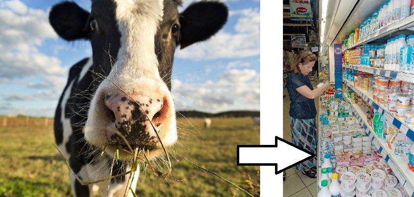

# Онтологическое проектирование индустриального предприятия 4.0

## 1. Введение ## 

Концепция «цифрового предприятия» как платформы, объединяющей интеллектуальную сеть датчиков, устройств оборудования реального предприятия, и виртуальный образ этого предприятия в виде «цифрового двойника» является самым передовым направлением развития мировой экономики. 

### 1.1. Цель и актуальность работы ###

В ходе всероссийского открытого урока, который проходил в Ярославле в сентябре 2017 года, президент РФ Владимир Путин заявил, что если какая-либо страна добьется лидерства в создании искусственного интеллекта, она "будет властелином мира". Поэтому, предприятие, которое внедрит интеллектуальные технологии на своем производстве, получит колоссальное преимущество по отношению к конкурентам.

## 2. Видение будущего развития автоматизации предприятия «Савушкин продукт» ##

Будущее в внедрении систем искусственного интеллекта на предприятии. Данный процесс должен основываться на том, что уже есть на предприятии [1].

## 3. Формализация задач, возникающих при осуществлении деятельности предприятия ##

Любая задача - это комплексная логистическая задача. Но даже решение относительно простых подзадач (например, складская логистика) не так очевидно [2].

### 3.1. Общий подход к формализации задач ###

Задача должна быть решена в комплексе. Решение должно отображать ход выполнения, собирая информацию из различных источников.

### 3.2. Формализация задач на примере логистики продукта "Хуторок" ###

Рассмотрим кратко процессы, которые стоят на пути от получения молока от коровы, до поступления продукта на прилавок магазина:

Более детализированная схема:

1. Молочная ферма
    1. Корова
    2. Танк
2. Молочный завод
    1. Молоковоз
    2. Пост приемки
    3. Танк приемки
    4. Танк молокохранилища
    5. ПОУ
    6. Коагулятор
    7. ПФУ
    8. Охладитель
    9. Коробка
    10. Паллета (поддон)
    11. Склад
    12. Зона комплектации
    13. Грузовик
19. Магазин
    1. Полка
    2. Покупатель

Молоко после доения на молочной ферме собирается в специальную емкость (танк) и охлаждается перед закачкой в молоковоз. Также проводятся различные лабораторные анализы (органолептические, химические и другие) чтобы определить качество молока. Информация о пробах фиксируется (учетная система предприятия, обычно **1C**).  
Далее молоко перекачивается в молоковоз, который везет его непосредственно на молочный завод. Его движение отслеживается, так как необходимо максимально быстро перекачать его в танк (уже на заводе) и сохранить свежим (холодным). Для решения данной задачи могут использоваться различные средства мониторинга положения автотранспорта (карты **OpenStreetMap** + информация от *GPS*-навигатора машины, *GPS*-навигатор сотового телефона водителя и т.п.). Также логист может непосредственно звонить водителю для уточнения его местонахождения.  
После приезда на молочный завод, лаборатория снова выполняет анализы (учетная система предприятия) и определяется куда (в какой танк с какого поста) будет осуществляться перекачка. Далее оператор приемки перекачивает молоко (используется **SCADA**-система для управления процессом), вводит необходимые данные для материального учета входного сырья (учетная система предприятия).  
Молоко перекачивается в танк молокохранилища, охлаждается. Оператор приемки в координации с оператором аппаратного цеха и оператором творожного цеха осуществляет приготовление смеси (используются *ПОУ*) и подачу ее в нужный коагулятор творожного цеха (несколько **SCADA**-систем, каждый оператор использует свой проект). Мастера соответствующих цехов также ведут записи о межцеховом перемещении материальных ценностей (учетная система предприятия).  
Из смеси в коагуляторе творожного цеха оператор готовит творожную массу, далее подает ее для формовки на *ПФУ*, далее операторы фасовочной линии (или **роботы**) перекладывают сформованный продукт в потребительскую тару - в полиэтиленовую упаковку. Упакованный творог маркируется, охлаждается и операторами (или **роботами**) укладывается в коробки, коробки укладываются на поддоны и через конвейер попадают на автоматический склад (система управления складом - **WMS-система**).  
Поддон из автоматического склада по конвейеру доставляется в зону комплектации (**WMS-система**). Далее кладовщики (или **роботы**) осуществляют загрузку уже машин. Мастера при этом ведут записи об отгрузке готовой продукции (учетная система предприятия).  
Машины доставляют продукцию конкретным заказчикам (магазинам, торговым сетям и т.д.). Логисты следят за доставкой продукта покупателю (карты **OpenStreetMap** + информация от *GPS*-навигатора машины, *GPS*-навигатор сотового телефона водителя, контрольные звонки водителю и т.п.).  
Данное описание не является строгим, в нем присутствуют некоторые упрощения, но даже оно позволяет оценить сложность логистического процесса для творога Хуторок - задействовано много людей, используется около десятка различных программных средств, ограничения на длительность изготовления (часы) и реализацию (дни). Также здесь опущены процессы планирования, которые также очень важны и сложны.

### 3.3 Семантическая модель логистики продукта "Хуторок" ###

Была описана процедура изготовления творога, используя язык PFC. Также были описаны некоторые логистические задачи. Это было сделано на платформе **OSTIS**. Результаты приведены здесь.

## 4. Заключение ##

## Список цитированных источников
[1] Garbrecht S. (2017). The three rules of Industrial Operations Management and Industrial IoT Applications.
https://www.linkedin.com/pulse/three-rules-industrial-operations-management-iot-steven-garbrecht/  
[2] Колчмахин Ю. Складские бизнес-процессы. Складской комплекс, 1. 2014. http://www.logscm.ru/wp-content/uploads/2014/06/Статья-Складские-бизнес-процессы-Автор-Колмачихин-Юрий.pdf  
