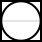

# Piping and Instrumentation Diagram/Drawing (P&ID) #
## О языке ##

Язык P&ID основывается на International Society of Automation (ISA) Standard S5.1 и предназначен для описания диаграмм, которые показывают взаимосвязь технологического оборудования и приборов, используемых для управления процессом. 
Основной чертеж или схема на языке P&ID используются для изображения установки управления технологическими процессами.

## Элементы P&ID ##

Рассмотрим элементы схем необходимые для составления узла нагрева.

### Нормально закрытый клапан ###

  

Рисунок 1 –  Изображение нормально закрытого клапана

### Нормально открытый клапан ###

Рисунок 2 – Изображение нормально открытого клапана

### Запорная арматура ###

.svg)

Рисунок 3 – Запорный клапан (НЗ)

### Регулируемый клапан ###

.svg)

Рисунок 4 – Регулируемый клапан (НЗ)

### Ручная запорная арматура ### 

Нормально закрытая 

.svg)

Рисунок 5 – Ручной запорный клапан (НЗ)

Нормально открытая 

.svg)

Рисунок 6 – Ручной запорный клапан (НО)

### Фильтр ###  

Рисунок 7 – Фильтр

### Конденсатоотводчик ###  

Рисунок 8 – Конденсатоотводчик

### Насос ###

Рисунок 9 – Центробежный насос

### Ёмкость ###

Рисунок 10 – Вертикальный резервуар

### Трубчатый теплообменник ###

Рисунок 11 – Трубчатый теплообменник(пар сверху вниз, продукт слева направо)

### Дренаж ###

Рисунок 12 – Дренаж

### Приборы и функциональные символы ###  

Рисунок 13 – Прибор для измерения установленный на проекте

Рисунок 14 – Функциональный символ

### Элементы трубопровода ### 

  

Рисунок 15 – Обвод труб

  

Рисунок 16 – Соединение труб
