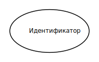
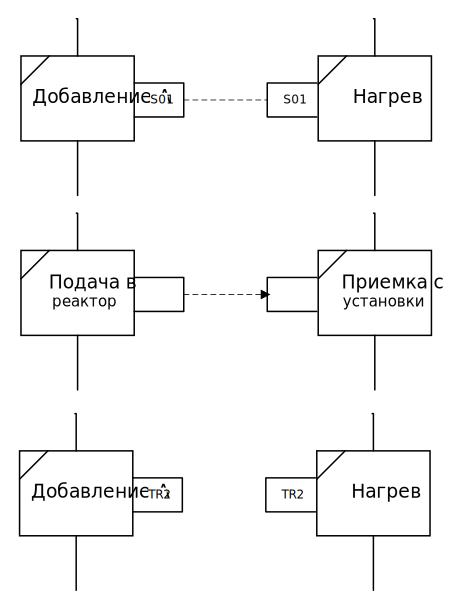

# Procedure Function Charts (PFC) #
## О языке ##

Язык PFC определяется в главе 6 стандарта **ISA-88.00.02** и предназначен для описания рецептов со сложными процедурами, включающими параллельные шаги и условные ветвления. *Использование PFC отделяет процедурные элементы рецепта от процедурных элементов оборудования в том, что, однажды начавшись, процедурные элементы оборудования выполняются независимо.* PFC-диаграмма отражает иерархическую организацию процедурных элементов рецептуры, и, в силу этого, процедурные элементы разных уровней должны быть легко различимы.

PFC-диаграммы изображают процедурную логику, используя набор значков, соединенных направленными связями, указывающими порядок исполнения процедурных элементов. Процедурные элементы могут выполняться параллельно или последовательно, а их выполнение может зависеть от некоторых условий. На диаграммах PFC изображается исполнение процедур, операций, фаз, вычисление переходов (evaluation of transitions). В общем случае диаграмма читается сверху вниз, слева направо. PFC диаграммы используются для изображения процедурной логики рецептов различных уровней – процедуры, процедуры технологической установки, операции. Габариты элементов и толщина линий стандартом не регулируются и оставлены на усмотрение конкретной реализации.

## Алфавит языка ##

Алфавит языка PFC включает следующие элементы:
* Процедурные элементы
* Начало и конец процедуры
* Распределение ресурсов
* Синхронизация процедурных элементов
* Переходы между процедурными элементами
* Структуры – простое последовательное исполнение, выбор ветви исполнения, параллельно выполняемые ветви

### Процедурные элементы ###

Рисунок 1 – (слева направо) Изображение процедуры, процедуры технологической установки, операции, фазы

Стандартом **ISA-88** определяется только четыре уровня процедурной иерархии. При этом допускается вводить собственные уровни иерархии, обозначая их соответствующим образом графически по аналогии с уже введенными уровнями или текстовой пометкой в верхнем левом углу изображения процедурного элемента. Процедурные элементы (за исключением фаз) могут включать в себя процедурные элементы более низкого уровня. Такие процедурные элементы могут «растягиваться» и изображать внутри себя вложенную диаграмму, описывающую процедуру, обозначаемую данным процедурным элементом. Когда вложенная диаграмма скрыта, процедурный элемент обозначается значком «плюс» в своем правом верхнем углу и значком «минус», когда она изображена.

### Начало и конец процедуры ###

Всякая диаграмма (как основная, так и вложенная) должна содержать по меньшей мере один значок начала процедуры и один значок конца процедуры. Соответствующие значки изображены на рисунке 2.

Рисунок 2 – Изображения начала (слева) и конца (справа) процедуры

### Распределение ресурсов ###

Для целей планирования производства либо в связи с ограничениями рецептуры может понадобиться распределение и согласование использования общих ресурсов (сырья, оборудования и др.). Назначение ресурса процедуре или ветви исполнения изображается на диаграмме в виде овала, внутри которого указывается спецификация ресурса. Спецификация ресурса записывается в текстовом виде и содержит данные и/или логику назначения ресурса, а также временные ограничения. За выделением ресурса может следовать условный переход, обозначающий условие начала выполнения последующего процедурного элемента. Значок выделения ресурса может также использоваться для обозначения явного освобождения ресурса, что должно быть явно сказано в спецификации ресурса. Пример значка выделения ресурса приведен на рисунке 3.

Рисунок 3 – Значок выделения ресурса

### Синхронизация процедурных элементов ###

Синхронизация процедурных элементов изображается в виде прямоугольников «торчащих» из любой стороны изображения процедурных элементов, участвующих в синхронизации. Значки синхронизации могут быть соединены штриховой или любой другой линией, легко отличимой от направленной связи в случае, если размещение процедурных элементов позволяет использовать такую нотацию. Если синхронизация подразумевает передачу материала, к линии добавляется стрелка в направлении передачи материала. Если линию использовать невозможно или нежелательно, то можно назначать уникальные идентификаторы значкам синхронизации при процедурных элементах, участвующих в синхронизации. Идентификаторы должны быть одинаковыми в рамках одной группы синхронизируемых процедурных элементов. На рисунке 4 изображены возможные варианты изображения синхронизации процедурных элементов.

Рисунок 4 – (сверху вниз) Изображение синхронизации с использованием соединительной линии, стрелки (при передаче материала) и без использования соединительной линии

### Переходы между процедурными элементами ###

Переходы бывают условные и безусловные. Безусловный переход означает, что следующий процедурный элемент начнет свое выполнение сразу после окончания выполнения предыдущего процедурного элемента. Для безусловного перехода логическое условие не указывается. Безусловный переход указывается на диаграмме ориентированной связью, соединяющей два процедурных элемента одного уровня иерархии. Условный переход дополнительно обозначается двумя близко расположенными чертами, перпендикулярными соединительной линии. Рядом с ними указывается условие перехода – выражение в свободной форме, имеющее свойство истинности (т.е., в любой заданный момент времени о нем можно сказать что оно либо истинно, либо ложно). Язык логических выражений стандартом не определяется. Проверка условия начинает производиться в момент начала выполнения непосредственно предшествующего условному переходу процедурного элемента. Условные переходы могут использоваться для:
*	предотвращения исполнения ветви процедурной логики рецепта;
*	для запроса на завершение непосредственно предшествующего ему процедурного элемента.

Когда условие перехода становится истинным, непосредственно предшествующий процедурный элемент получает запрос на завершение. Если прешествующий процедурный элемент уже завершил выполнение, условие перехода продолжит вычисляться до тех пор, пока не станет истинным. Выполнение следующего за условным переходом процедурного элемента начинается тогда и только тогда, когда условие перехода истинно и непосредственно предшествующий процедурный элемент завершил выполнение. Изображения переходов приведены на рисунке 5.

Рисунок 5 – Изображение безусловного (слева) и условного (справа) переходов

Пример простейшей процедуры приведен на рисунке 6.

Рисунок 6 – Изображение операции перемешивания

### Структурирование процедур ###

Структуры задают определенный порядок исполнения процедурных элементов.
Стандартом ISA-88 рассматривается три типа структур:
* простое последовательное исполнение
* выбор ветви исполнения
* параллельно выполняемые ветви

### Простое последовательное исполнение ###

Процедурные элементы активируются последовательно в порядке, указанном ориентированными связями. Порядок чтения по умолчанию – сверху вниз, слева направо. Если в силу размещения изображений процедурных элементов и их связей порядок интерпретации неочевиден, то на соответствующих условных переходах стрелкой указывается направление перехода. Стрелки на переходах преимущественно используются, когда необходимо изобразить циклическое исполнение некоторой ветви процедурной логики.

### Выбор ветви исполнения ###

Структура выбора ветви исполнения используется, когда в зависимости от некоторого условия необходимо реализовать различную процедурную логику. Она состоит из элемента начала выбора ветви исполнения, двух и более ветвей исполнения, и элемента слияния ветвей.

Начало выбора ветви исполнения изображается горизонтальной линией, из которой исходит два или более ориентированных перехода, по одному на каждую из ветвей, из которых необходимо осуществить выбор. Каждая ветвь должна начинаться и заканчиваться изображением перехода.

Результатом выбора из нескольких ветвей является инициация одной и только одной ветви исполнения. Условия при условных переходах в начале ветвей проверяются слева направо. Проверка условий начинается после инициации предшествующего выбору ветви исполнения процедурному элементу. Инициируется та ветвь, в которой условие при первом условном переходе оказалось истинным раньше, чем в остальных ветвях.

Элемент слияния ветвей изображается горизонтальной линией, в которую входят ветви исполнения, исходившие из элемента начала выбора ветви исполнения. Всякая ветвь исполнения, исходившая из элемента начала выбора ветви исполнения, должна входить в элемент слияния ветвей исполнения.

### Параллельно исполняемые ветви ###

Структура параллельно исполняемых ветвей используется, когда в зависимости от некоторого условия (либо безусловно) должно параллельно выполняться несколько ветвей процедурной логики.

Структура параллельно исполняемых ветвей состоит из элемента начала параллельно исполняемых ветвей, двух и более ветвей исполнения, и элемента слияния параллельно исполняемых ветвей.

Элемент начала параллельно исполняемых ветвей изображается двойной горизонтальной линией, из которой исходит два или более ориентированных перехода, по одному на каждую из параллельно исполняемых ветвей. Каждая ветвь должна начинаться и заканчиваться изображением перехода.

В отличие от структуры выбора ветви исполнения, структура параллельно исполняемых ветвей подразумевает возможность выбора более одной ветви исполнения и независимое исполнение процедурных элементов ветвей. Если необходимо синхронизировать исполнение процедурных элементов ветвей, то необходимо использовать элементы синхронизации процедурных элементов языка PFC.

Элемент слияния параллельно исполняемых ветвей изображается двойной горизонтальной линией, в которую входят ветви исполнения, исходившие из элемента начала параллельно исполняемых ветвей. Всякая ветвь исполнения, исходившая из элемента начала параллельно исполняемых ветвей, должна входить в элемент слияния параллельно исполняемых ветвей.

