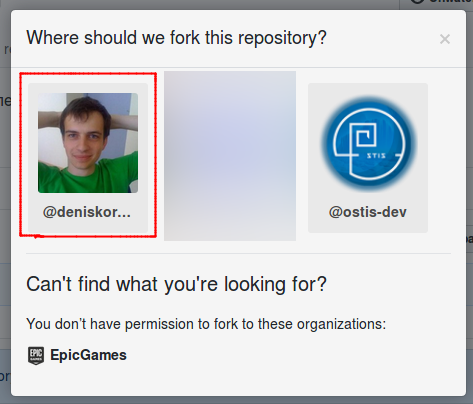
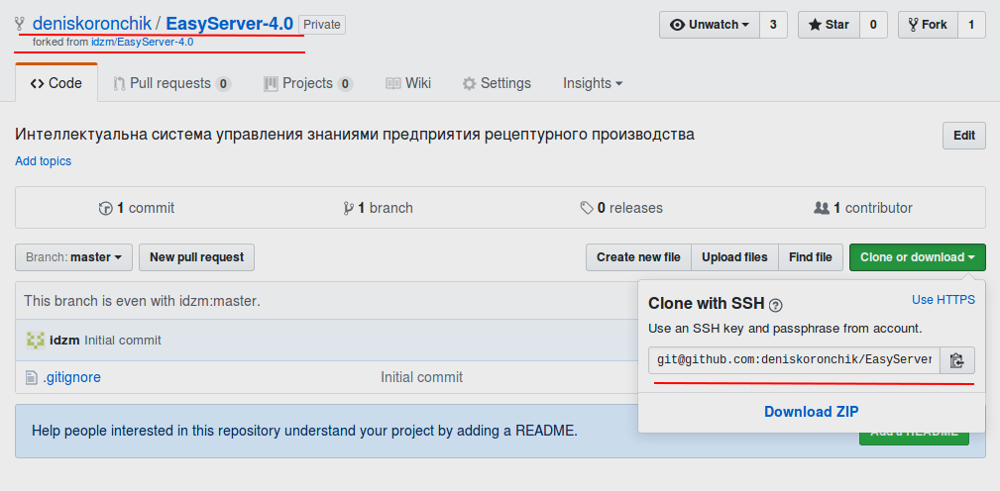

## Принципы работы с репозиторием

Прежде чем начать работу с репозиторием, необходимо сделать его клон. Для этого необходимо нажать кнопку `Fork` в правом верхнем углу экрана:


Если появилось окно с выбором организации, то следует выбрать свой профиль:


После этого клонируем себе свой форк репозитория:


Команда для клонирования:
```sh
git clone git@github.com:<your account name>/EasyServer-4.0.git
```

Далее будет описаны основные команды и ситуации при работе с репозиторием, все они доступны и в различных GUI инструментах:
- [GitKraken](https://www.gitkraken.com/) - хороший инструмент, который работает на Windows, Linux, OSX;
- [GitX-dev](https://rowanj.github.io/gitx/) - отличный инструмент для OSX;
- огромный [список](https://git.wiki.kernel.org/index.php/Interfaces,_frontends,_and_tools#Graphical_Interfaces) различных инструментов.

Чтобы удобно было работать, сразу стоит сделать себе ветку для работы:
```sh
git checkout -b dev
```
Теперь можно работать с версией в своей ветке `dev`. **Настоятельно рекомендуется использовать ветку для разработки, а не `master`**

Добавим наш основной репозиторий, чтобы с него можно было обновляться (более [подробно](https://git-scm.com/book/ru/v1/%D0%9E%D1%81%D0%BD%D0%BE%D0%B2%D1%8B-Git-%D0%A0%D0%B0%D0%B1%D0%BE%D1%82%D0%B0-%D1%81-%D1%83%D0%B4%D0%B0%D0%BB%D1%91%D0%BD%D0%BD%D1%8B%D0%BC%D0%B8-%D1%80%D0%B5%D0%BF%D0%BE%D0%B7%D0%B8%D1%82%D0%BE%D1%80%D0%B8%D1%8F%D0%BC%D0%B8) про команды):
```sh
git remote add upstream git@github.com:idzm/EasyServer-4.0.git
```

**Важно:** используйте следующие имена для `remote` ссылок:
- `upstream` - основной репозиторий (центральный), на нем всегда стабильная версия в `master`;
- `origin` - ваш `fork` основного репозитория.

Разделение на `upstream` и `origin` позволяет вам не бояться "сломать" что-либо в основном репозитории. Так как вся ваша работа будет происходить с `fork`-ом.

Далее будет ряд команд, которые позволят получать обновления и работать с основным репозиторием:
- обновление вашей текущей версии до последнего состояния:
```sh
git checkout master       # переключаемся на ветку master
git remote update         # обвновляем все remote
git merge upstream/master # переносим в наш локальный мастер все изменения
git push origin master    # пушим в наш форк свежий master
git checkout dev          # переключаемся на нашу рабочую ветку
git rebase master         # переносим изменения из мастера в нашу ветку
```
Для переноса изменений мы используем `rebase` - это позволяет сделать историю изменений легкой для чтения (более подробно можно почитать [тут](https://git-scm.com/book/ru/v1/%D0%92%D0%B5%D1%82%D0%B2%D0%BB%D0%B5%D0%BD%D0%B8%D0%B5-%D0%B2-Git-%D0%9F%D0%B5%D1%80%D0%B5%D0%BC%D0%B5%D1%89%D0%B5%D0%BD%D0%B8%D0%B5) или [тут](https://habrahabr.ru/post/161009/)). Если интересно чем это лучше `merge` то можно почитать эту [статью](https://www.atlassian.com/git/tutorials/merging-vs-rebasing).

## Создание и оформление commit-ов

Каждый `commit` в репозиторий должен быть атомарным и иметь комментарий. Атомарность комита заключается в том, что в нем находятся изменения в рамках одной задачи. Например: не стоит делать в одном комите две такие вещи - переименование термина `x` в термин `y`; удаление ненужных файлов.

Стоит из этого сделать два отдельных коммита:
- переименование термина `x` в термин `y`;
- удаление ненужных файлов.

Каждый комит НЕ должен приводить систему в "сломанное" состояние. После каждого из них она должна работать.

Чтобы упростить навигацию по истории к комитам необходимо приписывать метки 
```
[метка] Содержвание комита (#issue)
[метка1][метка2] Содержание комита (#issue)
```

Возможные варианты меток:
- `fix` - когда были исправления в имеющихся исходниках;
- `test` - добавление и изменения в unit-тестах;
- `doc` - изменения в докуменации;
- `kb` - изменения в исходниках БЗ;
- `config` - изменения в конфигурационных файлах и файлах поддержки репозитория (например: `.gitignore`);
- `review` - изменения по комментариям после review.

Например:
- исправили ошибки в БЗ тогда комит выглядит так: 
```
[kb][fix] Исправлена ошибка в БЗ (#38)  // где #38 ссылка на issue
```
- добавили в БЗ новые файлы и тесты к ним:
```
[kb][test] Добавлено описание формата X
```

Таким образом разработчик глядя на историю будет понимать что меняется и где.

## Pull requets

[Официальная документация](https://help.github.com/articles/creating-a-pull-request/) по созданию Pull Request. 

К pull request применяются следующие правила:
- создается из своей ветки на ветку `master` в основном репозитории;
- автор НЕ имеет права делать `merge` своему Pull request;
- Pull request должен быть просмотрен как минимум 3-мя людьми;
- если имеются автоматические тесты, то мержить Pull request с НЕ работающими автоматическими тестами **строго запрещено**;
- просматривать Pull request могут все желающие и высказывать свое мнение по нему или отдельным его частям;
- Pull request принимается, когда все кто участвует в дисскусии пришли к "общему знаменателю".

Ревью:
- для написания комментариев к исходникам в Pull request, необходимо перейти на вкладку `Files changed` и добавлять комментарии к необходимым строкам:

;
- если ревьювер считает что Pull Request можно мержить и нет необходимых правок, то он делает `Approve`. Если же требуются изменения, то `Request changes`:

